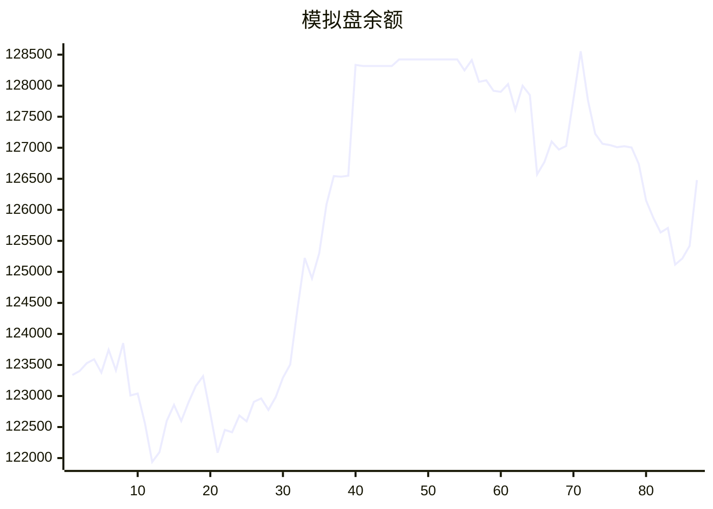

# 📈 AI模拟盘 自动交易报告

本项目利用 Github Action 定时运行 Claude Code，并结合MCP工具，实现在欧易模拟盘环境下自动交易。

## 资产明细
- **BTC**: $39127.6
- **ETH**: $13254.5
- **SOL**: $12060.3
- **USDT**: $62037.8

## 交易记录
- 2025-11-12T06:32:37.497808 - Market analysis completed for BTC, ETH, SOL
- 2025-11-12T05:20:16.692156 - Sell 2 ETH, Market order
- 2025-11-12T05:20:16.692153 - Buy 50 USDT worth of SOL, Market order
- 2025-11-12T03:15:20.892071 - Buy 100 SOL-USDT at market price
- 2025-11-12T03:15:20.892069 - Buy 10 ETH-USDT at market price
- 2025-11-12T03:15:20.892066 - Buy 1 BTC-USDT at market price
- 2025-11-12T02:50:02.274759 - Bought 1.0 SOL at market price
- 2025-11-12T02:50:02.274755 - Sold 1.4 ETH at market price
- 2025-11-11T19:58:01.234235 - Buy 20 SOL, spent ~3180 USDT
- 2025-11-11T19:58:01.234232 - Buy 0.5 ETH, spent ~1734 USDT

## MCP工具
- [mcp-aktools](https://github.com/aahl/mcp-aktools): 用于查询价格走势及行情
- [mcp-okx](https://github.com/aahl/mcp-okx): 用于获取欧易账户信息和下单
- [mcp-notify](https://github.com/aahl/mcp-notify): 用于推送分析结果到指定渠道(可选)
- [mcp-hooks](https://github.com/aahl/ai-trading/tree/main/mcp-hooks.py): 用于保存交易结果和更新Readme

## 相关链接
- https://t.me/s/mcpBtc
- [自动交易工作流配置文件](https://github.com/aahl/ai-trading/blob/main/.github/workflows/claude.yaml)
- [自动交易工作流运行记录](https://github.com/aahl/ai-trading/actions/workflows/claude.yaml)
- [智谱免费模型可用于 Claude Code](https://www.bigmodel.cn/invite?icode=EwilDKx13%2FhyODIyL%2BKabHHEaazDlIZGj9HxftzTbt4%3D)
- [GLM Coding Plan·限时优惠](https://www.bigmodel.cn/claude-code?ic=WTOWFVEJXH)
- [欧易模拟盘API接口申请](https://www.okx.com/zh-hans/help/how-can-i-do-spot-trading-with-the-jupyter-notebook)
