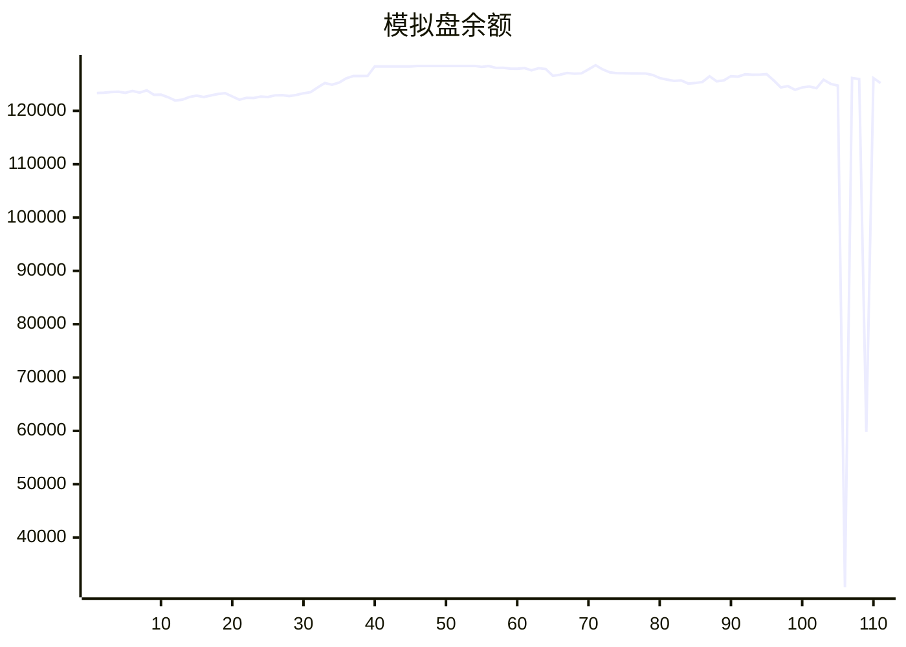

# 📈 AI模拟盘 自动交易报告

本项目利用 Github Action 定时运行 Claude Code，并结合MCP工具，实现在欧易模拟盘环境下自动交易。

## 资产明细
- **USDT**: $41283.1
- **BTC**: $36047.6
- **SOL**: $35313.7
- **ETH**: $12568.6

## 交易记录
- 2025-11-13T13:37:09.870496 - Buy 228.70 SOL, spent ~$1000 USDT
- 2025-11-13T13:37:09.870494 - Buy 2.4539 ETH, spent ~$2000 USDT
- 2025-11-13T13:37:09.870491 - Buy 0.3524 BTC, spent ~$5000 USDT
- 2025-11-13T12:44:36.578082 - Buy 30 SOL, spent 4595.7 USDT
- 2025-11-13T12:44:36.578077 - Buy 30 SOL, spent 4595.7 USDT
- 2025-11-13T11:29:59.400496 - Sell 50 SOL-USDT at $155
- 2025-11-13T11:29:59.400493 - Buy 0.5 ETH-USDT at $3420
- 2025-11-13T10:26:54.352235 - Bought 0.1 BTC-USDT at market price, added to position
- 2025-11-13T10:26:54.352233 - Sold 200 SOL-USDT at market price, reduced risk exposure
- 2025-11-13T10:26:54.352230 - Sold 0.5 ETH-USDT at market price, locked profits

## MCP工具
- [mcp-aktools](https://github.com/aahl/mcp-aktools): 用于查询价格走势及行情
- [mcp-okx](https://github.com/aahl/mcp-okx): 用于获取欧易账户信息和下单
- [mcp-notify](https://github.com/aahl/mcp-notify): 用于推送分析结果到指定渠道(可选)
- [mcp-hooks](https://github.com/aahl/ai-trading/tree/main/mcp-hooks.py): 用于保存交易结果和更新Readme

## 相关链接
- https://t.me/s/mcpBtc
- [自动交易工作流配置文件](https://github.com/aahl/ai-trading/blob/main/.github/workflows/claude.yaml)
- [自动交易工作流运行记录](https://github.com/aahl/ai-trading/actions/workflows/claude.yaml)
- [智谱免费模型可用于 Claude Code](https://www.bigmodel.cn/invite?icode=EwilDKx13%2FhyODIyL%2BKabHHEaazDlIZGj9HxftzTbt4%3D)
- [GLM Coding Plan·限时优惠](https://www.bigmodel.cn/claude-code?ic=WTOWFVEJXH)
- [欧易模拟盘API接口申请](https://www.okx.com/zh-hans/help/how-can-i-do-spot-trading-with-the-jupyter-notebook)
