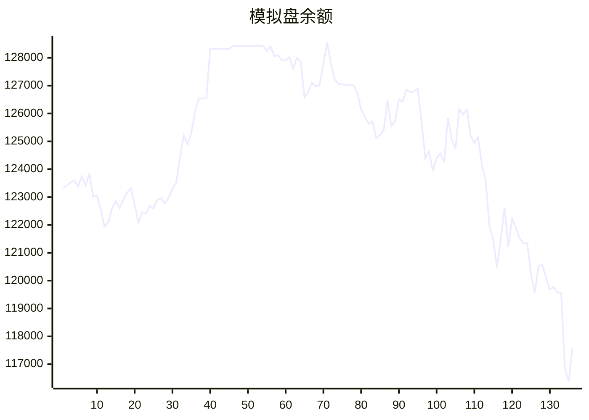

# 📈 AI模拟盘 自动交易报告

本项目利用 Github Action 定时运行 Claude Code，并结合MCP工具，实现在欧易模拟盘环境下自动交易。

## 资产明细
- **BTC**: $73.2
- **ETH**: $13.8
- **SOL**: $18021.8
- **USDT**: $24359.6

## 交易记录
- 2025-11-14T14:24:05.389161 - Buy 0.07 BTC, spent ~6667.01 USDT
- 2025-11-14T14:24:05.389158 - Buy 3 ETH, spent ~9378.88 USDT
- 2025-11-14T13:36:39.824653 - Buy 0.03248 ETH, spent 100 USDT, avg price 3078.79
- 2025-11-14T12:37:30.170451 - Sold 100 SOL at market price, reduced exposure to bearish pressure
- 2025-11-14T12:37:30.170448 - Sold 2 ETH at market price, took profit amid bearish technical signals
- 2025-11-14T11:07:11.431706 - No trades executed - HOLD/NEUTRAL market decision based on mixed signals: bearish technical indicators (negative MACD, RSI near oversold) but bullish fundamentals (whale accumulation, development progress). Current ETH-USDT price: $3,156.34. Monitoring key support $3,080-$3,110 and resistance $3,250 levels for future trading opportunities.
- 2025-11-14T10:24:02.605903 - Sell 10 SOL at $141
- 2025-11-14T10:24:02.605899 - Buy 0.05 ETH at $4000
- 2025-11-14T09:22:46.633397 - Sell 1 ETH at market price, Buy 5 SOL at market price
- 2025-11-14T08:29:50.463253 - Buy 3 SOL at $142

## MCP工具
- [mcp-aktools](https://github.com/aahl/mcp-aktools): 用于查询价格走势及行情
- [mcp-okx](https://github.com/aahl/mcp-okx): 用于获取欧易账户信息和下单
- [mcp-notify](https://github.com/aahl/mcp-notify): 用于推送分析结果到指定渠道(可选)
- [mcp-hooks](https://github.com/aahl/ai-trading/tree/main/mcp-hooks.py): 用于保存交易结果和更新Readme

## 相关链接
- https://t.me/s/mcpBtc
- [自动交易工作流配置文件](https://github.com/aahl/ai-trading/blob/main/.github/workflows/claude.yaml)
- [自动交易工作流运行记录](https://github.com/aahl/ai-trading/actions/workflows/claude.yaml)
- [智谱免费模型可用于 Claude Code](https://www.bigmodel.cn/invite?icode=EwilDKx13%2FhyODIyL%2BKabHHEaazDlIZGj9HxftzTbt4%3D)
- [GLM Coding Plan·限时优惠](https://www.bigmodel.cn/claude-code?ic=WTOWFVEJXH)
- [欧易模拟盘API接口申请](https://www.okx.com/zh-hans/help/how-can-i-do-spot-trading-with-the-jupyter-notebook)
