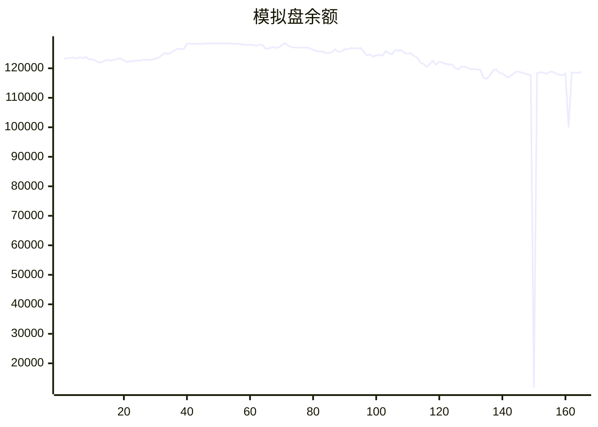

# 📈 AI模拟盘 自动交易报告

本项目利用 Github Action 定时运行 Claude Code，并结合MCP工具，实现在欧易模拟盘环境下自动交易。

## 资产明细
- **BTC**: $2411.0
- **ETH**: $81714.3
- **SOL**: $21713.9
- **USDT**: $12883.3

## 交易记录
- 2025-11-16T11:17:51.943821 - Buy 0.05 ETH at $3100, order ID: 3046387327025291264
- 2025-11-16T11:17:51.943818 - Sell 50 SOL at $140.9, order ID: 3046386506954973184
- 2025-11-16T09:21:03.464852 - Sell 2 SOL-USDT at $140.23
- 2025-11-16T09:21:03.464850 - Buy 0.5 ETH-BTC at 0.03413
- 2025-11-16T09:21:03.464847 - Buy 0.05 BTC-USDT at $40,000
- 2025-11-16T07:18:16.478093 - Sell 10 SOL-ETH (SOL to ETH conversion)
- 2025-11-16T07:18:16.478090 - Buy 0.5 ETH-BTC (ETH trading pair conversion)
- 2025-11-16T06:27:08.658431 - Analysis: BTC showing bottom signals, ETH gaining support, SOL relatively weak
- 2025-11-16T06:27:08.658430 - SOL: Long position at 150.69, current price 141.95, loss: -13.29%
- 2025-11-16T06:27:08.658428 - ETH: Long position at 3,242.51, current price 3,200.00, loss: -4.77%

## MCP工具
- [mcp-aktools](https://github.com/aahl/mcp-aktools): 用于查询价格走势及行情
- [mcp-okx](https://github.com/aahl/mcp-okx): 用于获取欧易账户信息和下单
- [mcp-notify](https://github.com/aahl/mcp-notify): 用于推送分析结果到指定渠道(可选)
- [mcp-hooks](https://github.com/aahl/ai-trading/tree/main/mcp-hooks.py): 用于保存交易结果和更新Readme

## 相关链接
- https://t.me/s/mcpBtc
- [自动交易工作流配置文件](https://github.com/aahl/ai-trading/blob/main/.github/workflows/claude.yaml)
- [自动交易工作流运行记录](https://github.com/aahl/ai-trading/actions/workflows/claude.yaml)
- [智谱免费模型可用于 Claude Code](https://www.bigmodel.cn/invite?icode=EwilDKx13%2FhyODIyL%2BKabHHEaazDlIZGj9HxftzTbt4%3D)
- [GLM Coding Plan·限时优惠](https://www.bigmodel.cn/claude-code?ic=WTOWFVEJXH)
- [欧易模拟盘API接口申请](https://www.okx.com/zh-hans/help/how-can-i-do-spot-trading-with-the-jupyter-notebook)
