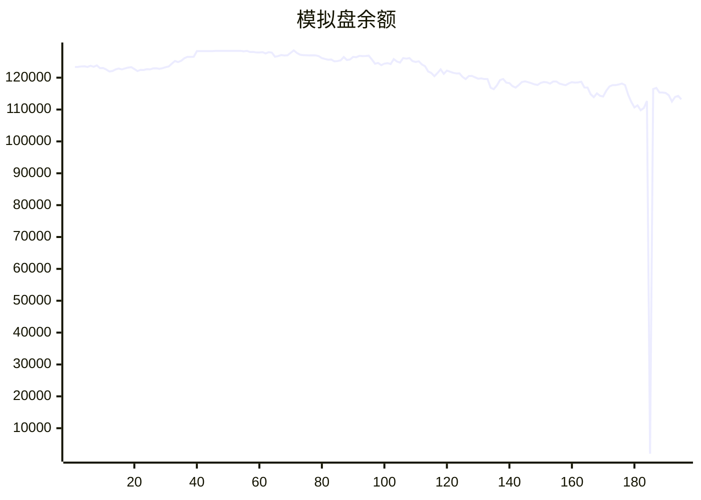

# 加密货币交易AI代理

这是一个基于Claude Agent SDK的加密货币交易AI代理，用于自动分析市场行情并执行交易操作。

## 功能特性

- 🎯 **支持交易对**: BTC-USDT, ETH-USDT, SOL-USDT, ETH-BTC, SOL-BTC, SOL-ETH
- 📊 **市场分析**: 使用crypto-market-analyzer代理进行深度市场分析
- 🤖 **智能交易**: 使用okx-trading-executor代理执行交易
- 💾 **结果保存**: 自动保存交易结果和统计数据
- 📱 **Telegram推送**: 实时推送交易报告到Telegram

## 主要组件

### CryptoTradingAgent
核心交易代理类，负责：
- 市场行情分析
- 交易决策执行
- 结果保存与推送

### 主要功能
1. `analyze_market()` - 分析市场行情
2. `execute_trades()` - 执行交易操作
3. `save_trading_result()` - 保存交易结果
4. `send_telegram_report()` - 发送Telegram报告
5. `run_trading_cycle()` - 完整交易周期

## 使用方法

### 运行交易代理

```bash
python crypto_trading_agent.py
```

### 配置交易参数

编辑 `trading_config.py` 文件，根据需要调整交易参数：
- 最大仓位大小
- 止损止盈比例
- 分析参数
- 模拟交易设置

## 安全说明

⚠️ **重要提醒**：
- 该交易账户为**模拟环境**，不是实盘环境
- 所有接口返回的资产余额数据均不是真实数据
- 请仅用于学习和测试目的
- 加密货币交易存在高风险，请谨慎投资

## 技术架构

1. **市场分析层**: 使用crypto-market-analyzer代理进行技术分析和市场趋势判断
2. **交易执行层**: 使用okx-trading-executor代理在OKX交易平台执行交易
3. **结果管理层**: 使用save_trading_result工具保存交易记录和统计数据
4. **通知推送层**: 使用Telegram工具推送交易报告和重要通知

## 依赖项

- Claude Agent SDK
- asyncio
- json
- logging
- datetime
- pathlib

## 许可证

仅供学习使用，请勿用于实际交易。

---

## AI模拟盘自动交易报告

本项目利用 Github Action 定时运行 Claude Code，并结合MCP工具，实现在欧易模拟盘环境下自动交易。



### 资产明细
- **BTC**: $40994.7
- **ETH**: $23615.5
- **SOL**: $2988.9
- **USDT**: $37286.2

### 交易记录
- 2025-11-19T14:34:46.962165 - Sell 3 ETH at 0.03331 BTC for 0.09993 BTC
- 2025-11-19T14:34:46.962163 - Sell 2.68 ETH at $3,037.31 for $8,139.79
- 2025-11-19T14:34:46.962160 - Buy 0.11 SOL at $136.53 for $1,498.22
- 2025-11-19T10:44:10.485741 - Position rebalanced across BTC, ETH, SOL
- 2025-11-19T10:44:10.485738 - Auto trading completed successfully - 4 orders executed
- 2025-11-19T08:48:50.886403 - Sell 5.35 ETH @ $3,080.88, Buy 15 SOL @ $137 avg
- 2025-11-19T06:57:41.918349 - Buy 0.2 SOL, spent ~$27.84
- 2025-11-19T06:57:41.918344 - Buy 0.001 BTC, spent ~$90.47
- 2025-11-19T03:29:19.084981 - Buy 0.744545 SOL at $140.68, spent $105
- 2025-11-19T03:29:19.084975 - Buy 0.02384007 BTC at $92,262.6, spent $2,200

## MCP工具
- [mcp-aktools](https://github.com/aahl/mcp-aktools): 用于查询价格走势及行情
- [mcp-okx](https://github.com/aahl/mcp-okx): 用于获取欧易账户信息和下单
- [mcp-notify](https://github.com/aahl/mcp-notify): 用于推送分析结果到指定渠道(可选)
- [mcp-hooks](https://github.com/aahl/ai-trading/tree/main/mcp-hooks.py): 用于保存交易结果和更新Readme

## 相关链接
- https://t.me/s/mcpBtc
- [自动交易工作流配置文件](https://github.com/aahl/ai-trading/blob/main/.github/workflows/claude.yaml)
- [自动交易工作流运行记录](https://github.com/aahl/ai-trading/actions/workflows/claude.yaml)
- [智谱免费模型可用于 Claude Code](https://www.bigmodel.cn/invite?icode=EwilDKx13%2FhyODIyL%2BKabHHEaazDlIZGj9HxftzTbt4%3D)
- [GLM Coding Plan·限时优惠](https://www.bigmodel.cn/claude-code?ic=WTOWFVEJXH)
- [欧易模拟盘API接口申请](https://www.okx.com/zh-hans/help/how-can-i-do-spot-trading-with-the-jupyter-notebook)
