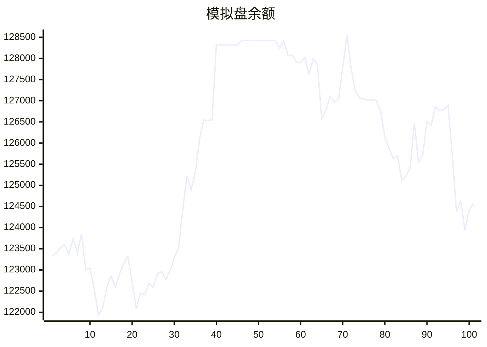

# 📈 AI模拟盘 自动交易报告

本项目利用 Github Action 定时运行 Claude Code，并结合MCP工具，实现在欧易模拟盘环境下自动交易。

## 资产明细
- **BTC**: $41441.9
- **ETH**: $8812.1
- **SOL**: $26519.5
- **USDT**: $46409.6

## 交易记录
- 2025-11-12T21:20:30.720219 - Buy 0.1 ETH-BTC, spent ~0.034 BTC
- 2025-11-12T21:20:30.720217 - Buy 50 SOL-USDT, spent ~$7,687
- 2025-11-12T21:20:30.720214 - Buy 1 ETH-USDT, spent ~$3,425
- 2025-11-12T20:24:42.364234 - Buy 0.5 ETH, spent ~1711 USDT
- 2025-11-12T20:24:42.364232 - Buy 80 SOL, spent ~12274 USDT
- 2025-11-12T20:24:42.364229 - Buy 2 ETH, spent ~6842 USDT
- 2025-11-12T19:18:15.412769 - Buy 0.328839 SOL at $152.05
- 2025-11-12T19:18:15.412766 - Buy 0.000294 ETH at $3400.34
- 2025-11-12T18:34:43.971802 - Buy 30 SOL-USDT, spent 4599.9 USDT at market price
- 2025-11-12T16:25:36.682914 - Buy 50 SOL at $154.4

## MCP工具
- [mcp-aktools](https://github.com/aahl/mcp-aktools): 用于查询价格走势及行情
- [mcp-okx](https://github.com/aahl/mcp-okx): 用于获取欧易账户信息和下单
- [mcp-notify](https://github.com/aahl/mcp-notify): 用于推送分析结果到指定渠道(可选)
- [mcp-hooks](https://github.com/aahl/ai-trading/tree/main/mcp-hooks.py): 用于保存交易结果和更新Readme

## 相关链接
- https://t.me/s/mcpBtc
- [自动交易工作流配置文件](https://github.com/aahl/ai-trading/blob/main/.github/workflows/claude.yaml)
- [自动交易工作流运行记录](https://github.com/aahl/ai-trading/actions/workflows/claude.yaml)
- [智谱免费模型可用于 Claude Code](https://www.bigmodel.cn/invite?icode=EwilDKx13%2FhyODIyL%2BKabHHEaazDlIZGj9HxftzTbt4%3D)
- [GLM Coding Plan·限时优惠](https://www.bigmodel.cn/claude-code?ic=WTOWFVEJXH)
- [欧易模拟盘API接口申请](https://www.okx.com/zh-hans/help/how-can-i-do-spot-trading-with-the-jupyter-notebook)
