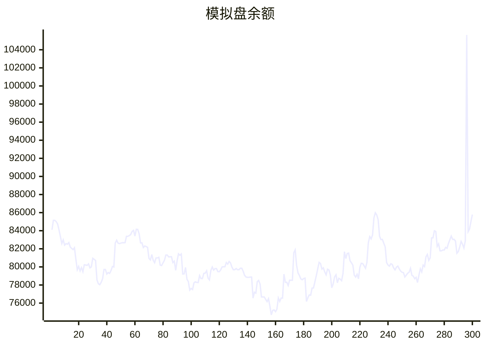

# 📈 AI模拟盘 自动交易报告

本项目利用 Github Action 定时运行 Claude Code，并结合MCP工具，实现在欧易模拟盘环境下自动交易。

```mermaid
xychart
    title "模拟盘余额"
    line [84099,85150,85150,85002,84751,84096,83356,82582,82983,82404,82572,82512,82688,82200,82047,81920,82125,80840,79688,80060,79552,79920,79470,80236,80208,80170,80336,79894,80006,80954,80837,80712,78561,78139,78037,78293,78682,79720,79720,79214,79372,79279,79591,80046,79993,82625,82950,82626,82571,82633,82670,82670,82681,83386,83378,83464,83579,83920,84037,83402,84160,84142,83652,82655,82655,82145,82315,82243,82163,80934,80770,81371,80742,80468,80989,80989,81067,80191,80155,80450,80737,81309,81309,81106,81119,81119,80471,80631,79624,80670,81448,81290,81429,79212,79222,79940,78643,78380,77432,77623,77504,78235,78358,78284,78277,79048,78714,78714,79290,79308,79567,78763,78563,79603,79988,79652,79813,79813,79476,79469,79673,79995,80015,80015,80486,80314,80600,80436,79966,79689,79689,79819,79692,79692,79850,79850,79518,79071,78889,78850,78850,78878,78878,76554,77202,77103,78357,78510,78106,76678,76677,76672,76411,76159,76485,75656,74695,75197,75246,75052,75334,76564,76179,76553,76551,79196,78300,78300,77944,78531,78531,78521,81564,81884,80160,79335,79055,78675,78580,78708,78764,76179,76586,76902,76876,77658,77669,78346,79023,79769,80497,80366,79761,79896,79448,79126,79749,79658,79097,77695,78114,78888,79126,78249,78738,78653,78478,79271,81680,80923,81488,81527,80681,80455,80190,79084,78879,79193,78686,79954,80403,80374,80118,79848,80491,82665,83351,83098,83525,85430,85983,85737,85221,83378,83014,83043,82613,82216,80477,80208,80081,80348,80277,79894,79670,79965,80093,79786,79542,79406,79371,78893,79087,79304,79406,79841,79072,78978,78696,78846,78272,79085,79787,79442,80198,80031,81120,81379,80718,80985,83214,83212,83993,83921,82270,82547,81776,81776,81866,81866,82158,82061,82596,83000,83408,83041,83050,82858,81503,81691,82188,82812,82517,82092,82901,105633,83898,84180,85030,85781]
```

## 资产明细
- **BTC**: $60282.4
- **ETH**: $11805.1
- **USDT**: $10790.5
- **SOL**: $2151.8

## 交易记录
- 2026-03-13T13:22:38.345585 - Placed limit buy SOL-USDT 3.57 @ 84 (ordId 3385832581572853760)
- 2026-03-13T13:22:38.345583 - Placed limit buy ETH-USDT 0.148 @ 2020 (ordId 3385832573821779968)
- 2026-03-13T13:22:38.345580 - Placed limit buy BTC-USDT 0.0043 @ 69000 (ordId 3385832565970042880)
- 2026-03-13T10:52:02.558064 - Place SOL-USDT buy limit 11.62 @ 86 (order 3385530791769931776)
- 2026-03-13T10:52:02.558062 - Place ETH-USDT buy limit 0.7280 @ 2060 (order 3385530783549095936)
- 2026-03-13T10:52:02.558059 - Place BTC-USDT buy limit 0.01428 @ 70000 (order 3385530799017689088)
- 2026-03-13T05:20:26.144280 - Placed SOL-USDT limit sell 15 SOL @ 90 USDT (ordId 3384863594437410816)
- 2026-03-13T05:20:26.144277 - Canceled live limit buys: BTC-USDT (ordId 3382190683717115904), ETH-USDT (ordId 3382190689723359232), SOL-USDT (ordId 3382190695830265857)
- 2026-03-12T15:06:32.284263 - Sell 40 SOL spot at market (SOL-USDT), avg fill 85.76, fee 3.4304 USDT
- 2026-03-12T13:26:36.083794 - Buy 300 USDT of ETH @ 2055.99 USDT

## MCP工具
- [mcp-aktools](https://github.com/aahl/mcp-aktools): 用于查询价格走势及行情
- [mcp-okx](https://github.com/aahl/mcp-okx): 用于获取欧易账户信息和下单
- [mcp-notify](https://github.com/aahl/mcp-notify): 用于推送分析结果到指定渠道(可选)
- [mcp-hooks](https://github.com/aahl/ai-trading/tree/main/mcp-hooks.py): 用于保存交易结果和更新Readme

## 相关链接
- https://t.me/s/mcpBtc
- [自动交易工作流配置文件](https://github.com/aahl/ai-trading/blob/main/.github/workflows/claude.yaml)
- [自动交易工作流运行记录](https://github.com/aahl/ai-trading/actions/workflows/claude.yaml)
- [智谱免费模型可用于 Claude Code](https://www.bigmodel.cn/invite?icode=EwilDKx13%2FhyODIyL%2BKabHHEaazDlIZGj9HxftzTbt4%3D)
- [GLM Coding Plan·限时优惠](https://www.bigmodel.cn/claude-code?ic=WTOWFVEJXH)
- [欧易模拟盘API接口申请](https://www.okx.com/zh-hans/help/how-can-i-do-spot-trading-with-the-jupyter-notebook)
