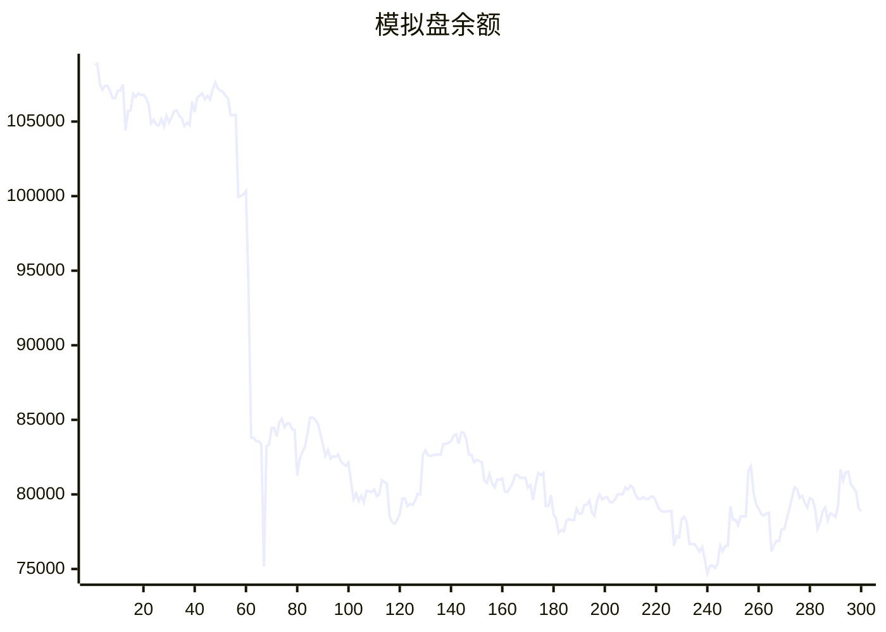

# 📈 AI模拟盘 自动交易报告

本项目利用 Github Action 定时运行 Claude Code，并结合MCP工具，实现在欧易模拟盘环境下自动交易。

```mermaid
xychart
    title "模拟盘余额"
    line [108797,108877,107536,107134,107393,107393,107046,106565,106565,107081,107081,107478,104404,105715,105749,106866,106651,106889,106771,106816,106565,106141,104876,105103,104796,104734,105169,104690,105380,104941,105272,105709,105739,105374,105227,104691,104924,104762,106364,105628,106608,106748,106872,106485,106721,106468,107132,107620,107224,107080,107001,106717,106567,105431,105431,105440,99950,100017,100113,100337,93749,83795,83807,83567,83567,83342,75168,83222,83336,84448,84449,83896,84839,85065,84499,84757,84757,84364,84347,81254,82385,82835,83184,84099,85150,85150,85002,84751,84096,83356,82582,82983,82404,82572,82512,82688,82200,82047,81920,82125,80840,79688,80060,79552,79920,79470,80236,80208,80170,80336,79894,80006,80954,80837,80712,78561,78139,78037,78293,78682,79720,79720,79214,79372,79279,79591,80046,79993,82625,82950,82626,82571,82633,82670,82670,82681,83386,83378,83464,83579,83920,84037,83402,84160,84142,83652,82655,82655,82145,82315,82243,82163,80934,80770,81371,80742,80468,80989,80989,81067,80191,80155,80450,80737,81309,81309,81106,81119,81119,80471,80631,79624,80670,81448,81290,81429,79212,79222,79940,78643,78380,77432,77623,77504,78235,78358,78284,78277,79048,78714,78714,79290,79308,79567,78763,78563,79603,79988,79652,79813,79813,79476,79469,79673,79995,80015,80015,80486,80314,80600,80436,79966,79689,79689,79819,79692,79692,79850,79850,79518,79071,78889,78850,78850,78878,78878,76554,77202,77103,78357,78510,78106,76678,76677,76672,76411,76159,76485,75656,74695,75197,75246,75052,75334,76564,76179,76553,76551,79196,78300,78300,77944,78531,78531,78521,81564,81884,80160,79335,79055,78675,78580,78708,78764,76179,76586,76902,76876,77658,77669,78346,79023,79769,80497,80366,79761,79896,79448,79126,79749,79658,79097,77695,78114,78888,79126,78249,78738,78653,78478,79271,81680,80923,81488,81527,80681,80455,80190,79084,78879]
```

## 资产明细
- **BTC**: $45684.4
- **ETH**: $18720.5
- **SOL**: $2367.0
- **USDT**: $12107.2

## 交易记录
- 2026-03-03T10:56:25.805050 - No new fills during this execution window
- 2026-03-03T10:56:25.805049 - Placed SOL-USDT limit buy 15 @ 81.8 (ordId: 3356548161129156608)
- 2026-03-03T10:56:25.805048 - Placed BTC-USDT limit buy 0.015 @ 66000 (ordId: 3356548155190022144)
- 2026-03-03T10:56:25.805046 - Canceled SOL-USDT limit buy 30 @ 82.2 (ordId: 3356317174533197824)
- 2026-03-03T10:56:25.805043 - Canceled BTC-USDT limit buy 0.025 @ 66400 (ordId: 3356317055347855360)
- 2026-03-03T09:01:45.998992 - Placed limit buy 30 SOL at 82.2 USDT
- 2026-03-03T09:01:45.998990 - Placed limit buy 0.025 BTC at 66400 USDT
- 2026-03-03T09:01:45.998987 - Placed limit sell 1.5 ETH at 1988 USDT
- 2026-03-03T07:07:03.240457 - Buy 0.04408901 BTC at avg 68044.1599234140208638 USDT (market)
- 2026-03-03T07:07:03.240455 - Buy 1.50221 ETH at avg 1997.0575742273051039 USDT (market)

## MCP工具
- [mcp-aktools](https://github.com/aahl/mcp-aktools): 用于查询价格走势及行情
- [mcp-okx](https://github.com/aahl/mcp-okx): 用于获取欧易账户信息和下单
- [mcp-notify](https://github.com/aahl/mcp-notify): 用于推送分析结果到指定渠道(可选)
- [mcp-hooks](https://github.com/aahl/ai-trading/tree/main/mcp-hooks.py): 用于保存交易结果和更新Readme

## 相关链接
- https://t.me/s/mcpBtc
- [自动交易工作流配置文件](https://github.com/aahl/ai-trading/blob/main/.github/workflows/claude.yaml)
- [自动交易工作流运行记录](https://github.com/aahl/ai-trading/actions/workflows/claude.yaml)
- [智谱免费模型可用于 Claude Code](https://www.bigmodel.cn/invite?icode=EwilDKx13%2FhyODIyL%2BKabHHEaazDlIZGj9HxftzTbt4%3D)
- [GLM Coding Plan·限时优惠](https://www.bigmodel.cn/claude-code?ic=WTOWFVEJXH)
- [欧易模拟盘API接口申请](https://www.okx.com/zh-hans/help/how-can-i-do-spot-trading-with-the-jupyter-notebook)
