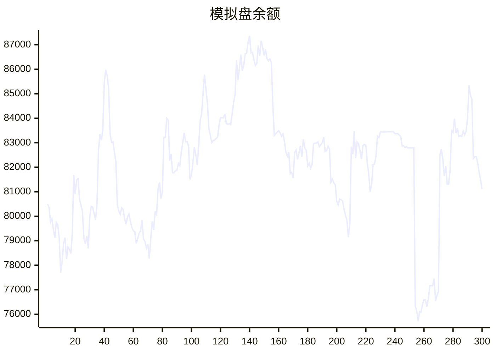

# 📈 AI模拟盘 自动交易报告

本项目利用 Github Action 定时运行 Claude Code，并结合MCP工具，实现在欧易模拟盘环境下自动交易。

```mermaid
xychart
    title "模拟盘余额"
    line [80497,80366,79761,79896,79448,79126,79749,79658,79097,77695,78114,78888,79126,78249,78738,78653,78478,79271,81680,80923,81488,81527,80681,80455,80190,79084,78879,79193,78686,79954,80403,80374,80118,79848,80491,82665,83351,83098,83525,85430,85983,85737,85221,83378,83014,83043,82613,82216,80477,80208,80081,80348,80277,79894,79670,79965,80093,79786,79542,79406,79371,78893,79087,79304,79406,79841,79072,78978,78696,78846,78272,79085,79787,79442,80198,80031,81120,81379,80718,80985,83214,83212,83993,83921,82270,82547,81776,81776,81866,81866,82158,82061,82596,83000,83408,83041,83050,82858,81503,81691,82188,82812,82517,82092,82901,83898,84180,85030,85781,85178,84604,83569,83298,83008,83093,83107,83175,83228,83729,84025,84017,84019,84177,83775,83762,83785,83738,84160,84639,84939,86370,85548,86046,86599,85942,86161,86622,86664,87115,87369,86666,86685,86384,86152,86243,86969,86548,87164,86885,86566,86809,86427,86348,86417,86273,84538,83299,83369,83430,83490,83404,83270,83362,83056,82605,82459,82614,81734,81788,81551,82598,82702,82320,82580,82878,82426,83139,82778,82686,82056,82166,81963,82110,82951,82983,82984,83038,82838,82915,82998,83235,82642,82682,82858,82746,81396,81512,81362,81277,80600,80461,80699,80673,80616,80288,80038,79836,79142,79722,82837,82533,83480,82366,83032,82960,82654,82330,82883,82934,82901,82188,81728,81005,81298,82110,82135,82449,83264,83203,83440,83439,83440,83440,83446,83447,83448,83447,83448,83449,83369,83369,83369,83313,83256,82872,82873,82801,82844,82785,82791,82791,82793,82794,76339,76145,75714,76110,76096,76397,76594,76585,76310,76607,77160,77170,77160,77456,76541,76774,76927,82520,82744,82337,81639,82040,81307,81314,81887,83490,83414,83984,83396,83594,83261,83287,83253,83470,83327,83465,83987,85348,84930,84786,82355,82433,82438,82167,81795,81466,81105]
```

## 资产明细
- **BTC**: $39686.6
- **ETH**: $36343.3
- **SOL**: $5067.0
- **USDT**: $8.3

## 交易记录
- 2026-04-12T13:34:43.496155 - Bought 0.343687 ETH using 0.01 BTC on ETH-BTC at avg price 0.0290962182159931 BTC/ETH in simulated trading.
- 2026-04-12T11:11:42.780549 - Bought 3.7245 SOL using 0.15 ETH via SOL-ETH market order after one reduced-size retry due to slippage protection.
- 2026-04-12T11:11:42.780545 - Sold 0.37 ETH for BTC via ETH-BTC market order at 0.02921.
- 2026-04-12T09:18:10.083391 - Sold 1 ETH into BTC via ETH-BTC market order at avg 0.0296441299499989 BTC/ETH; net BTC received after fee: 0.02961448582005 BTC; order id 3472308815051358208.
- 2026-04-12T07:52:05.320962 - Placed ETH-USDT limit buy order: 0.19 ETH @ 2205 USDT (status: live, unfilled; ordId: 3472136648602943488)
- 2026-04-12T03:49:51.683586 - Buy 0.26 ETH via ETH-BTC at 0.03017 BTC, spent 0.0078442 BTC, fee 0.00026 ETH, order 3471646802717442048
- 2026-04-11T22:50:50.883903 - Order ETHUSDT20260411SIMEXEC02 filled at an average price of 2297.503324028443 USDT for 0.087051 ETH, with a fee of 0.000087051 ETH.
- 2026-04-11T22:50:50.883900 - Bought ETH on ETH-USDT spot using a conservative market order in cash mode, spending 200 USDT.
- 2026-04-11T20:56:03.830243 - No trade executed: held positions due to already-large ETH exposure and conservative risk control.
- 2026-04-11T19:10:17.544005 - Preferred market view remains bullish ETH-USDT, but risk management and anti-overtrading constraints favor holding existing spot exposure.

## MCP工具
- [mcp-aktools](https://github.com/aahl/mcp-aktools): 用于查询价格走势及行情
- [mcp-okx](https://github.com/aahl/mcp-okx): 用于获取欧易账户信息和下单
- [mcp-notify](https://github.com/aahl/mcp-notify): 用于推送分析结果到指定渠道(可选)
- [mcp-hooks](https://github.com/aahl/ai-trading/tree/main/mcp-hooks.py): 用于保存交易结果和更新Readme

## 相关链接
- https://t.me/s/mcpBtc
- [自动交易工作流配置文件](https://github.com/aahl/ai-trading/blob/main/.github/workflows/claude.yaml)
- [自动交易工作流运行记录](https://github.com/aahl/ai-trading/actions/workflows/claude.yaml)
- [智谱免费模型可用于 Claude Code](https://www.bigmodel.cn/invite?icode=EwilDKx13%2FhyODIyL%2BKabHHEaazDlIZGj9HxftzTbt4%3D)
- [GLM Coding Plan·限时优惠](https://www.bigmodel.cn/claude-code?ic=WTOWFVEJXH)
- [欧易模拟盘API接口申请](https://www.okx.com/zh-hans/help/how-can-i-do-spot-trading-with-the-jupyter-notebook)
