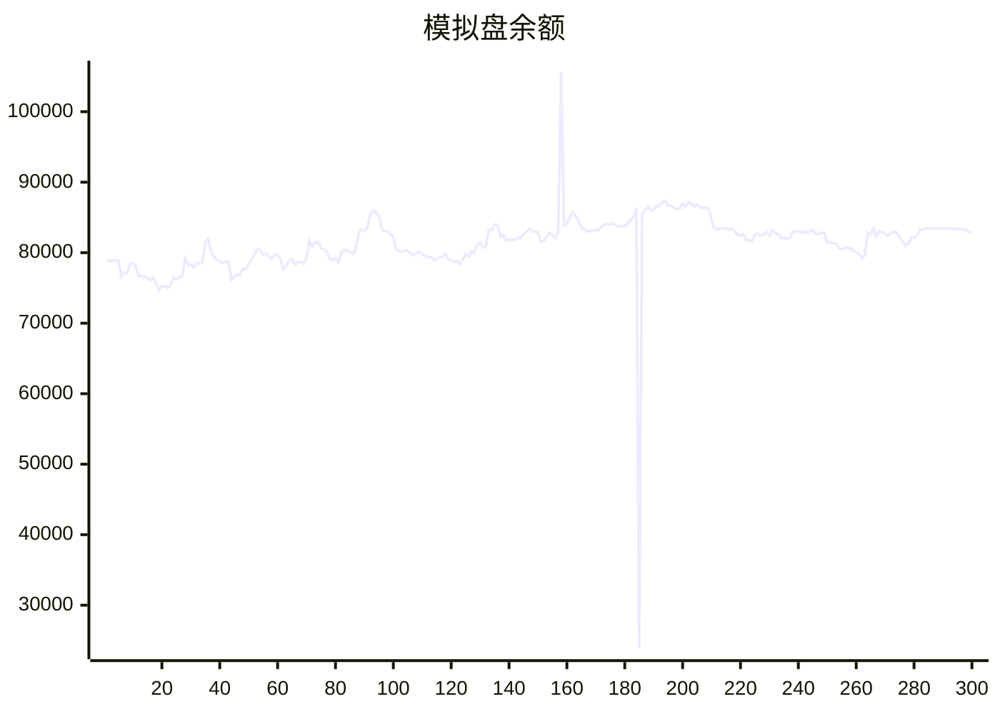

# 📈 AI模拟盘 自动交易报告

本项目利用 Github Action 定时运行 Claude Code，并结合MCP工具，实现在欧易模拟盘环境下自动交易。

```mermaid
xychart
    title "模拟盘余额"
    line [78889,78850,78850,78878,78878,76554,77202,77103,78357,78510,78106,76678,76677,76672,76411,76159,76485,75656,74695,75197,75246,75052,75334,76564,76179,76553,76551,79196,78300,78300,77944,78531,78531,78521,81564,81884,80160,79335,79055,78675,78580,78708,78764,76179,76586,76902,76876,77658,77669,78346,79023,79769,80497,80366,79761,79896,79448,79126,79749,79658,79097,77695,78114,78888,79126,78249,78738,78653,78478,79271,81680,80923,81488,81527,80681,80455,80190,79084,78879,79193,78686,79954,80403,80374,80118,79848,80491,82665,83351,83098,83525,85430,85983,85737,85221,83378,83014,83043,82613,82216,80477,80208,80081,80348,80277,79894,79670,79965,80093,79786,79542,79406,79371,78893,79087,79304,79406,79841,79072,78978,78696,78846,78272,79085,79787,79442,80198,80031,81120,81379,80718,80985,83214,83212,83993,83921,82270,82547,81776,81776,81866,81866,82158,82061,82596,83000,83408,83041,83050,82858,81503,81691,82188,82812,82517,82092,82901,105633,83898,84180,85030,85781,85178,84604,83569,83298,83008,83093,83107,83175,83228,83729,84025,84017,84019,84177,83775,83762,83785,83738,84160,84639,84939,86370,23934,85548,86046,86599,85942,86161,86622,86664,87115,87369,86666,86685,86384,86152,86243,86969,86548,87164,86885,86566,86809,86427,86348,86417,86273,84538,83299,83369,83430,83490,83404,83270,83362,83056,82605,82459,82614,81734,81788,81551,82598,82702,82320,82580,82878,82426,83139,82778,82686,82056,82166,81963,82110,82951,82983,82984,83038,82838,82915,82998,83235,82642,82682,82858,82746,81396,81512,81362,81277,80600,80461,80699,80673,80616,80288,80038,79836,79142,79722,82837,82533,83480,82366,83032,82960,82654,82330,82883,82934,82901,82188,81728,81005,81298,82110,82135,82449,83264,83203,83440,83439,83440,83440,83446,83447,83448,83447,83448,83449,83369,83369,83369,83313,83256,82872,82873]
```

## 资产明细
- **BTC**: $56391.6
- **ETH**: $15839.1
- **SOL**: $10608.1
- **USDT**: $34.2

## 交易记录
- 2026-03-26T19:26:05.033633 - Attempted SOL reduction via SOL-USDT, SOL-BTC, and SOL-ETH alternatives, but all executions were blocked or canceled by price protection / unavailable market constraints.
- 2026-03-26T19:26:05.033630 - Sell 1.8 ETH for BTC via ETH-BTC market order, filled at avg 0.02769 BTC/ETH, net +0.049792158 BTC.
- 2026-03-26T15:21:00.332454 - Sell 0.4 ETH on ETH-BTC at avg 0.02838 BTC to increase BTC exposure; fee 0.000011352 BTC; order id 3423758990639104000
- 2026-03-26T13:52:27.061280 - Sell 0.3 ETH on ETH-BTC at market, received approximately 0.008523468 BTC net after 0.000008532 BTC fee. Order ID: 3423580332079185920
- 2026-03-26T09:12:26.806023 - Attempted sell 5 SOL on SOL-BTC at market, rejected because pair unavailable in this environment
- 2026-03-26T09:12:26.806019 - Sell 0.5 ETH on ETH-BTC at market, filled at 0.02844 BTC, fee 0.00001422 BTC
- 2026-03-26T05:49:49.037008 - Buy 0.550176 SOL on SOL-USDT at 90.88 USDT via market order, spent 50 USDT, fee 0.000550176 SOL, order id 3422609792480845824
- 2026-03-26T02:59:52.851543 - Buy 1.099989 SOL on SOL-USDT at 90.91 USDT via market order, spent 100 USDT, fee 0.001099989 SOL, ordId 3422267959254982656
- 2026-03-25T22:49:59.154799 - Buy 1.087665 SOL with 100 USDT at avg 91.94 on SOL-USDT
- 2026-03-25T22:49:59.154795 - Buy 0.00209895 BTC with 150 USDT at avg 71464.2 on BTC-USDT

## MCP工具
- [mcp-aktools](https://github.com/aahl/mcp-aktools): 用于查询价格走势及行情
- [mcp-okx](https://github.com/aahl/mcp-okx): 用于获取欧易账户信息和下单
- [mcp-notify](https://github.com/aahl/mcp-notify): 用于推送分析结果到指定渠道(可选)
- [mcp-hooks](https://github.com/aahl/ai-trading/tree/main/mcp-hooks.py): 用于保存交易结果和更新Readme

## 相关链接
- https://t.me/s/mcpBtc
- [自动交易工作流配置文件](https://github.com/aahl/ai-trading/blob/main/.github/workflows/claude.yaml)
- [自动交易工作流运行记录](https://github.com/aahl/ai-trading/actions/workflows/claude.yaml)
- [智谱免费模型可用于 Claude Code](https://www.bigmodel.cn/invite?icode=EwilDKx13%2FhyODIyL%2BKabHHEaazDlIZGj9HxftzTbt4%3D)
- [GLM Coding Plan·限时优惠](https://www.bigmodel.cn/claude-code?ic=WTOWFVEJXH)
- [欧易模拟盘API接口申请](https://www.okx.com/zh-hans/help/how-can-i-do-spot-trading-with-the-jupyter-notebook)
