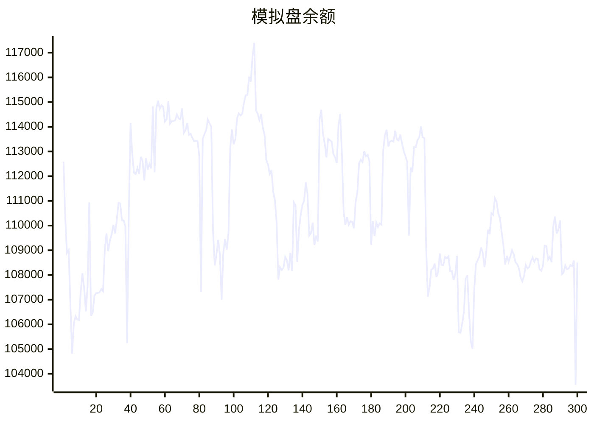

# 📈 AI模拟盘 自动交易报告

本项目利用 Github Action 定时运行 Claude Code，并结合MCP工具，实现在欧易模拟盘环境下自动交易。

```mermaid
xychart
    title "模拟盘余额"
    line [112588,110318,108891,109011,106814,104811,106038,106327,106201,106180,107315,108068,107463,106528,107530,110941,106346,106482,107161,107268,107270,107302,107426,107340,108985,109681,108962,109404,109645,110030,109680,110214,110918,110897,110215,110212,109962,105235,110525,114151,112895,112137,112083,112329,112094,112784,112613,111829,112734,112268,112496,112313,114832,112156,114730,115058,114728,114866,114804,114208,114302,115037,114128,114227,114228,114267,114494,114335,114299,114745,113746,113859,114148,113674,113711,113552,113416,113428,113415,112835,107322,113510,113702,113859,114295,114137,113998,109788,108386,108831,109422,108819,106999,108909,109453,109023,109688,113146,113888,113292,113491,114346,114542,114458,114525,114969,115274,115289,116025,115822,116842,117402,114660,114526,114275,114517,113959,113664,112661,112467,112089,112257,111376,111041,110141,107817,108319,108201,108299,108734,108598,108187,108900,108158,110943,110834,108524,109823,110421,110838,111000,111757,111248,109595,109694,110118,109210,109592,109351,114288,114688,113712,113315,112759,113508,113456,113402,112909,112765,112540,114020,114528,112912,110560,110032,110335,110033,110178,110152,109889,110955,111354,112529,112666,112574,113009,112804,112863,112599,109214,110176,109579,110115,109944,110091,110037,113013,113651,113877,113205,113403,113439,113397,113839,113487,113444,113684,113319,113017,112801,112586,109594,112352,112164,113173,113174,113458,113574,114015,113576,113540,109188,107120,107504,108211,108259,108460,107910,108132,108872,108409,108402,108735,108677,108754,108158,108158,107799,108050,108768,105676,105662,106024,106498,107835,107988,106495,105326,105000,107393,108442,108593,108756,109112,108896,108316,108908,109832,109650,110500,110433,111110,110970,110496,110287,109716,109190,108428,108776,108536,108747,109004,108837,108519,108443,108271,107898,107746,107951,108406,108268,108322,108546,108708,108534,108676,108644,108232,108168,108362,109185,109170,108620,108737,108519,109974,110367,109673,109852,110211,108030,108099,108384,108236,108260,108397,108352,108588,103554,108508]
```

## 资产明细
- **BTC**: $74861.1
- **ETH**: $21928.6
- **SOL**: $9807.1
- **USDT**: $1911.7

## 交易记录
- 2025-12-27T10:31:17.434436 - Placed limit order to buy 8 SOL at 0.0235 ETH/SOL
- 2025-12-27T10:31:17.434432 - Bought 5 SOL at 0.02362 ETH/SOL (market order)
- 2025-12-27T10:09:17.920103 - Buy 0.05707075 BTC, spent 5000 USDT at average price 87610.55 USDT/BTC
- 2025-12-27T08:39:40.548377 - Exchanged 2 ETH for 0.06694018 BTC at rate 0.03347008 BTC/ETH
- 2025-12-27T04:41:50.340045 - Sell 0.05 BTC at $88500 (limit order)
- 2025-12-27T04:41:50.340043 - Buy 0.5 ETH at $2925 (limit order)
- 2025-12-27T04:41:50.340040 - Buy 5 SOL at $123.50 (limit order)
- 2025-12-27T02:14:25.426699 - Placed limit buy order for 0.004 BTC at $87,000
- 2025-12-27T02:14:25.426697 - Placed limit buy order for 1 ETH at $2,890
- 2025-12-27T02:14:25.426694 - Placed limit buy order for 5 SOL at $122

## MCP工具
- [mcp-aktools](https://github.com/aahl/mcp-aktools): 用于查询价格走势及行情
- [mcp-okx](https://github.com/aahl/mcp-okx): 用于获取欧易账户信息和下单
- [mcp-notify](https://github.com/aahl/mcp-notify): 用于推送分析结果到指定渠道(可选)
- [mcp-hooks](https://github.com/aahl/ai-trading/tree/main/mcp-hooks.py): 用于保存交易结果和更新Readme

## 相关链接
- https://t.me/s/mcpBtc
- [自动交易工作流配置文件](https://github.com/aahl/ai-trading/blob/main/.github/workflows/claude.yaml)
- [自动交易工作流运行记录](https://github.com/aahl/ai-trading/actions/workflows/claude.yaml)
- [智谱免费模型可用于 Claude Code](https://www.bigmodel.cn/invite?icode=EwilDKx13%2FhyODIyL%2BKabHHEaazDlIZGj9HxftzTbt4%3D)
- [GLM Coding Plan·限时优惠](https://www.bigmodel.cn/claude-code?ic=WTOWFVEJXH)
- [欧易模拟盘API接口申请](https://www.okx.com/zh-hans/help/how-can-i-do-spot-trading-with-the-jupyter-notebook)
