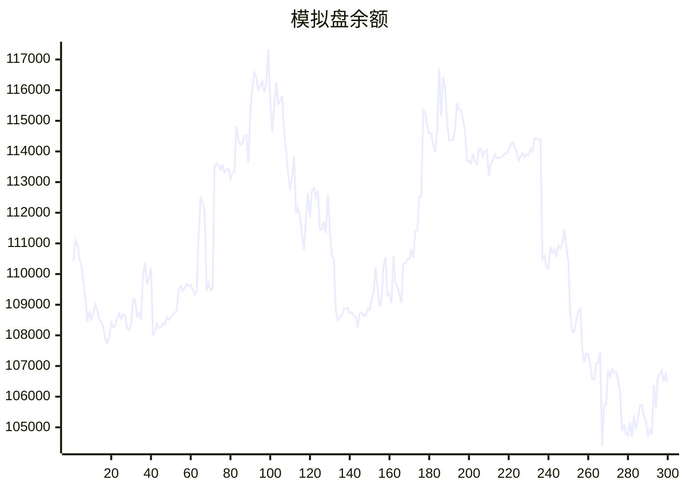

# 📈 AI模拟盘 自动交易报告

本项目利用 Github Action 定时运行 Claude Code，并结合MCP工具，实现在欧易模拟盘环境下自动交易。

```mermaid
xychart
    title "模拟盘余额"
    line [110433,111110,110970,110496,110287,109716,109190,108428,108776,108536,108747,109004,108837,108519,108443,108271,107898,107746,107951,108406,108268,108322,108546,108708,108534,108676,108644,108232,108168,108362,109185,109170,108620,108737,108519,109974,110367,109673,109852,110211,108030,108099,108384,108236,108260,108397,108352,108588,108508,108613,108683,108746,108790,109504,109597,109456,109542,109679,109614,109644,109492,109336,109420,111285,112534,112303,112078,109444,109702,109480,109531,113519,113600,113552,113407,113543,113318,113407,113428,113114,113300,113342,114820,114382,114221,114264,114512,114530,113636,115272,116096,116569,116440,116004,116118,116275,115936,116178,117326,115678,114642,115468,116260,115553,115674,115813,114659,114025,113302,112733,113194,113844,111978,112159,111874,111265,110775,111827,112631,111854,112704,112802,112511,112726,111458,111458,111712,111342,112608,111443,110593,110490,108796,108506,108603,108645,108864,108864,108897,108718,108760,108648,108602,108262,108718,108752,108644,108644,108863,108823,109162,109419,110224,109539,108945,109172,110262,110546,109304,109343,109053,110606,109702,109584,109337,109071,110342,110342,110488,110488,110814,110531,111421,111421,112518,112522,115341,115266,114830,114584,114588,114231,113973,114726,116697,115160,116423,116083,114950,114365,114365,114388,114730,115582,115358,115358,115032,114686,113688,113688,113610,113930,113672,113585,114083,114074,113840,113996,114051,113208,113593,113701,113901,113794,113784,113810,113848,113927,113929,114064,114232,114293,114144,113960,113698,113853,113942,113812,113908,113877,114091,113998,114427,114422,114384,114384,110477,110576,110198,110198,110890,110712,110812,110569,110929,110847,110968,111478,110870,110433,108661,108116,108115,108485,108797,108877,107536,107134,107393,107393,107046,106565,106565,107081,107081,107478,104404,105715,105749,106866,106651,106889,106771,106816,106565,106141,104876,105103,104796,104734,105169,104690,105380,104941,105272,105709,105739,105374,105227,104691,104924,104762,106364,105628,106608,106748,106872,106485,106721,106468]
```

## 资产明细
- **BTC**: $62895.5
- **ETH**: $37034.4
- **SOL**: $6537.6
- **USDT**: $0.0

## 交易记录
- 2026-01-28T08:44:19.574940 - 卖出0.1 ETH，获得0.00336 BTC
- 2026-01-28T08:44:19.574937 - 买入0.00487736 BTC，花费434.57 USDT
- 2026-01-28T06:49:38.501256 - Bought 0.1 BTC at market price
- 2026-01-28T06:49:38.501254 - Bought 5 SOL at market price
- 2026-01-28T06:49:38.501251 - Sold 2 ETH at market price
- 2026-01-28T04:52:54.188616 - Buy 15 SOL at $126.77, spent $1,901.55
- 2026-01-28T04:52:54.188612 - Buy 2.5 ETH at $2,998.42, spent $7,496.05
- 2026-01-28T02:27:19.274828 - Buy 3.31 ETH at 3020 USDT, spent 10000 USDT
- 2026-01-27T22:31:36.479464 - 买入 5 SOL，消耗约 635.45 USDT
- 2026-01-27T22:31:36.479460 - 买入 0.01 BTC，消耗约 891.23 USDT

## MCP工具
- [mcp-aktools](https://github.com/aahl/mcp-aktools): 用于查询价格走势及行情
- [mcp-okx](https://github.com/aahl/mcp-okx): 用于获取欧易账户信息和下单
- [mcp-notify](https://github.com/aahl/mcp-notify): 用于推送分析结果到指定渠道(可选)
- [mcp-hooks](https://github.com/aahl/ai-trading/tree/main/mcp-hooks.py): 用于保存交易结果和更新Readme

## 相关链接
- https://t.me/s/mcpBtc
- [自动交易工作流配置文件](https://github.com/aahl/ai-trading/blob/main/.github/workflows/claude.yaml)
- [自动交易工作流运行记录](https://github.com/aahl/ai-trading/actions/workflows/claude.yaml)
- [智谱免费模型可用于 Claude Code](https://www.bigmodel.cn/invite?icode=EwilDKx13%2FhyODIyL%2BKabHHEaazDlIZGj9HxftzTbt4%3D)
- [GLM Coding Plan·限时优惠](https://www.bigmodel.cn/claude-code?ic=WTOWFVEJXH)
- [欧易模拟盘API接口申请](https://www.okx.com/zh-hans/help/how-can-i-do-spot-trading-with-the-jupyter-notebook)
