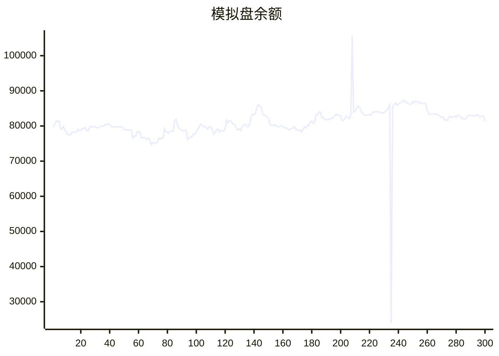

# 📈 AI模拟盘 自动交易报告

本项目利用 Github Action 定时运行 Claude Code，并结合MCP工具，实现在欧易模拟盘环境下自动交易。

```mermaid
xychart
    title "模拟盘余额"
    line [79624,80670,81448,81290,81429,79212,79222,79940,78643,78380,77432,77623,77504,78235,78358,78284,78277,79048,78714,78714,79290,79308,79567,78763,78563,79603,79988,79652,79813,79813,79476,79469,79673,79995,80015,80015,80486,80314,80600,80436,79966,79689,79689,79819,79692,79692,79850,79850,79518,79071,78889,78850,78850,78878,78878,76554,77202,77103,78357,78510,78106,76678,76677,76672,76411,76159,76485,75656,74695,75197,75246,75052,75334,76564,76179,76553,76551,79196,78300,78300,77944,78531,78531,78521,81564,81884,80160,79335,79055,78675,78580,78708,78764,76179,76586,76902,76876,77658,77669,78346,79023,79769,80497,80366,79761,79896,79448,79126,79749,79658,79097,77695,78114,78888,79126,78249,78738,78653,78478,79271,81680,80923,81488,81527,80681,80455,80190,79084,78879,79193,78686,79954,80403,80374,80118,79848,80491,82665,83351,83098,83525,85430,85983,85737,85221,83378,83014,83043,82613,82216,80477,80208,80081,80348,80277,79894,79670,79965,80093,79786,79542,79406,79371,78893,79087,79304,79406,79841,79072,78978,78696,78846,78272,79085,79787,79442,80198,80031,81120,81379,80718,80985,83214,83212,83993,83921,82270,82547,81776,81776,81866,81866,82158,82061,82596,83000,83408,83041,83050,82858,81503,81691,82188,82812,82517,82092,82901,105633,83898,84180,85030,85781,85178,84604,83569,83298,83008,83093,83107,83175,83228,83729,84025,84017,84019,84177,83775,83762,83785,83738,84160,84639,84939,86370,23934,85548,86046,86599,85942,86161,86622,86664,87115,87369,86666,86685,86384,86152,86243,86969,86548,87164,86885,86566,86809,86427,86348,86417,86273,84538,83299,83369,83430,83490,83404,83270,83362,83056,82605,82459,82614,81734,81788,81551,82598,82702,82320,82580,82878,82426,83139,82778,82686,82056,82166,81963,82110,82951,82983,82984,83038,82838,82915,82998,83235,82642,82682,82858,82746,81396]
```

## 资产明细
- **BTC**: $42055.2
- **ETH**: $27088.7
- **SOL**: $7765.6
- **USDT**: $4486.0

## 交易记录
- 2026-03-22T03:01:08.048943 - Buy 1.369863 ETH with 0.04 BTC on ETH-BTC via market order at avg 0.0292 BTC per ETH.
- 2026-03-21T20:41:13.489071 - Buy 0.393835 ETH using 0.0115 BTC on ETH-BTC at average price 0.0292 BTC per ETH in simulated spot account
- 2026-03-21T18:54:09.894481 - Sell 10 SOL on SOL-USDT at 89.77 USDT, gross 897.70 USDT, fee 0.8977 USDT, net 896.8023 USDT.
- 2026-03-21T16:45:49.311593 - No new trade executed; kept existing ETH-USDT buy limit 0.28 @ 2140 (clOrdId: ETHSPOT20260321CONS2140A, tag: PULLBACK).
- 2026-03-21T08:49:32.808531 - Placed ETH-USDT limit buy 0.28 @ 2140 USDT (live, conservative pullback entry)
- 2026-03-21T08:49:32.808529 - Canceled ETH-USDT limit buy 0.4716 @ 2120 USDT
- 2026-03-21T08:49:32.808526 - Canceled BTC-USDT limit buy 0.0072 @ 69300 USDT
- 2026-03-21T07:04:43.407854 - Buy 19.949019 SOL with 1800 USDT at avg price 90.23 on SOL-USDT spot market.
- 2026-03-21T05:17:18.348740 - Buy 5.533421 SOL on SOL-USDT at 90.36 USDT, spent 500 USDT, fee 0.005533421 SOL
- 2026-03-20T22:43:29.012719 - Kept existing limit buy order 0.0072 BTC at 69300 USDT on BTC-USDT (ordId: 3407022777752363008, status: live)

## MCP工具
- [mcp-aktools](https://github.com/aahl/mcp-aktools): 用于查询价格走势及行情
- [mcp-okx](https://github.com/aahl/mcp-okx): 用于获取欧易账户信息和下单
- [mcp-notify](https://github.com/aahl/mcp-notify): 用于推送分析结果到指定渠道(可选)
- [mcp-hooks](https://github.com/aahl/ai-trading/tree/main/mcp-hooks.py): 用于保存交易结果和更新Readme

## 相关链接
- https://t.me/s/mcpBtc
- [自动交易工作流配置文件](https://github.com/aahl/ai-trading/blob/main/.github/workflows/claude.yaml)
- [自动交易工作流运行记录](https://github.com/aahl/ai-trading/actions/workflows/claude.yaml)
- [智谱免费模型可用于 Claude Code](https://www.bigmodel.cn/invite?icode=EwilDKx13%2FhyODIyL%2BKabHHEaazDlIZGj9HxftzTbt4%3D)
- [GLM Coding Plan·限时优惠](https://www.bigmodel.cn/claude-code?ic=WTOWFVEJXH)
- [欧易模拟盘API接口申请](https://www.okx.com/zh-hans/help/how-can-i-do-spot-trading-with-the-jupyter-notebook)
