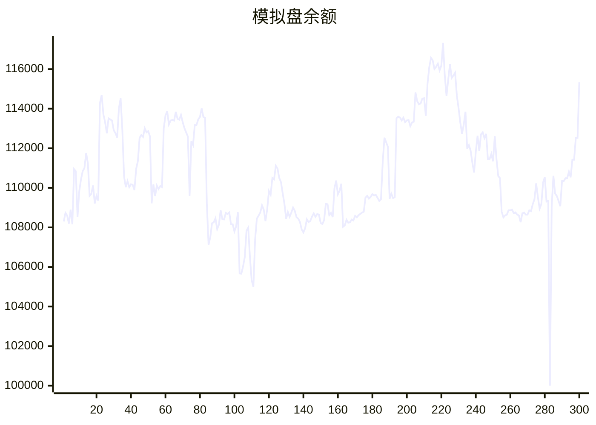

# 📈 AI模拟盘 自动交易报告

本项目利用 Github Action 定时运行 Claude Code，并结合MCP工具，实现在欧易模拟盘环境下自动交易。

```mermaid
xychart
    title "模拟盘余额"
    line [108299,108734,108598,108187,108900,108158,110943,110834,108524,109823,110421,110838,111000,111757,111248,109595,109694,110118,109210,109592,109351,114288,114688,113712,113315,112759,113508,113456,113402,112909,112765,112540,114020,114528,112912,110560,110032,110335,110033,110178,110152,109889,110955,111354,112529,112666,112574,113009,112804,112863,112599,109214,110176,109579,110115,109944,110091,110037,113013,113651,113877,113205,113403,113439,113397,113839,113487,113444,113684,113319,113017,112801,112586,109594,112352,112164,113173,113174,113458,113574,114015,113576,113540,109188,107120,107504,108211,108259,108460,107910,108132,108872,108409,108402,108735,108677,108754,108158,108158,107799,108050,108768,105676,105662,106024,106498,107835,107988,106495,105326,105000,107393,108442,108593,108756,109112,108896,108316,108908,109832,109650,110500,110433,111110,110970,110496,110287,109716,109190,108428,108776,108536,108747,109004,108837,108519,108443,108271,107898,107746,107951,108406,108268,108322,108546,108708,108534,108676,108644,108232,108168,108362,109185,109170,108620,108737,108519,109974,110367,109673,109852,110211,108030,108099,108384,108236,108260,108397,108352,108588,108508,108613,108683,108746,108790,109504,109597,109456,109542,109679,109614,109644,109492,109336,109420,111285,112534,112303,112078,109444,109702,109480,109531,113519,113600,113552,113407,113543,113318,113407,113428,113114,113300,113342,114820,114382,114221,114264,114512,114530,113636,115272,116096,116569,116440,116004,116118,116275,115936,116178,117326,115678,114642,115468,116260,115553,115674,115813,114659,114025,113302,112733,113194,113844,111978,112159,111874,111265,110775,111827,112631,111854,112704,112802,112511,112726,111458,111458,111712,111342,112608,111443,110593,110490,108796,108506,108603,108645,108864,108864,108897,108718,108760,108648,108602,108262,108718,108752,108644,108644,108863,108823,109162,109419,110224,109539,108945,109172,110262,110546,109304,109343,100000,109053,110606,109702,109584,109337,109071,110342,110342,110488,110488,110814,110531,111421,111421,112518,112522,115341]
```

## 资产明细
- **BTC**: $27034.8
- **ETH**: $38533.5
- **SOL**: $49773.1
- **USDT**: $0.0

## 交易记录
- 2026-01-13T22:33:56.607453 - Bought 10 SOL using 0.4526 ETH (avg price: 0.0453 ETH/SOL)
- 2026-01-13T22:33:56.607436 - Bought 0.5 ETH using 0.0174 BTC (avg price: 0.0348 BTC/ETH)
- 2026-01-13T20:35:34.027560 - 未执行新交易，维持现有持仓
- 2026-01-13T18:48:39.007457 - Buy 0.25 SOL with ETH (SOL-ETH pair)
- 2026-01-13T18:48:39.007454 - Buy 8 ETH at market price (~$3208.75 each)
- 2026-01-13T14:39:36.699993 - Bought 64.3 SOL at 143.54 USDT
- 2026-01-13T14:39:36.699990 - Sold 0.1 BTC at 92,656.47 USDT
- 2026-01-13T14:38:57.893106 - Bought 64.3 SOL at 143.54 USDT (Order ID: 3214941360756367360)
- 2026-01-13T14:38:57.893103 - Sold 0.1 BTC at 92656.47 USDT (Order ID: 3214939921170571264)
- 2026-01-13T13:05:17.830639 - Buy 1 ETH at market price

## MCP工具
- [mcp-aktools](https://github.com/aahl/mcp-aktools): 用于查询价格走势及行情
- [mcp-okx](https://github.com/aahl/mcp-okx): 用于获取欧易账户信息和下单
- [mcp-notify](https://github.com/aahl/mcp-notify): 用于推送分析结果到指定渠道(可选)
- [mcp-hooks](https://github.com/aahl/ai-trading/tree/main/mcp-hooks.py): 用于保存交易结果和更新Readme

## 相关链接
- https://t.me/s/mcpBtc
- [自动交易工作流配置文件](https://github.com/aahl/ai-trading/blob/main/.github/workflows/claude.yaml)
- [自动交易工作流运行记录](https://github.com/aahl/ai-trading/actions/workflows/claude.yaml)
- [智谱免费模型可用于 Claude Code](https://www.bigmodel.cn/invite?icode=EwilDKx13%2FhyODIyL%2BKabHHEaazDlIZGj9HxftzTbt4%3D)
- [GLM Coding Plan·限时优惠](https://www.bigmodel.cn/claude-code?ic=WTOWFVEJXH)
- [欧易模拟盘API接口申请](https://www.okx.com/zh-hans/help/how-can-i-do-spot-trading-with-the-jupyter-notebook)
