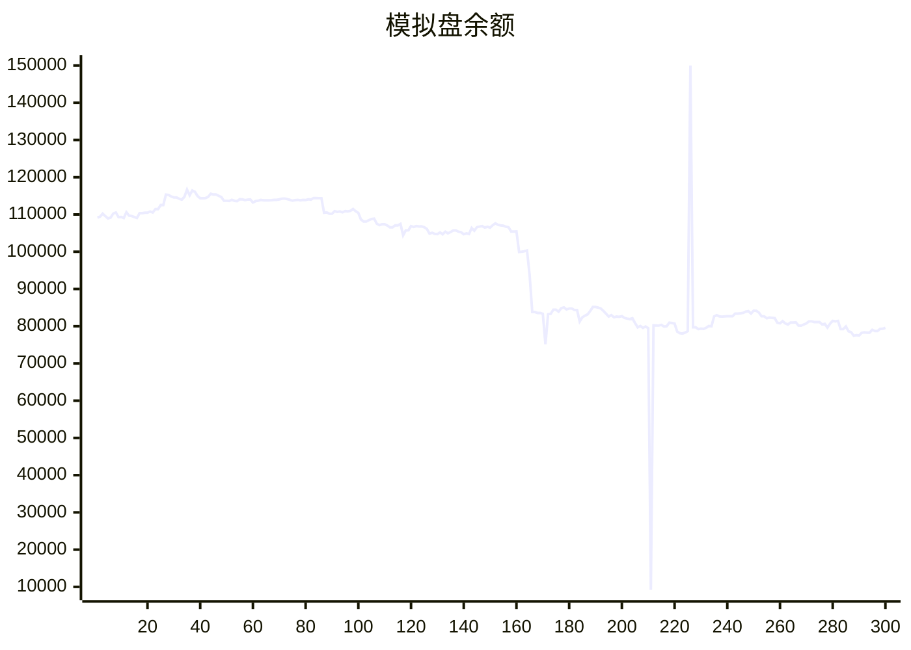

# 📈 AI模拟盘 自动交易报告

本项目利用 Github Action 定时运行 Claude Code，并结合MCP工具，实现在欧易模拟盘环境下自动交易。

```mermaid
xychart
    title "模拟盘余额"
    line [109162,109419,110224,109539,108945,109172,110262,110546,109304,109343,109053,110606,109702,109584,109337,109071,110342,110342,110488,110488,110814,110531,111421,111421,112518,112522,115341,115266,114830,114584,114588,114231,113973,114726,116697,115160,116423,116083,114950,114365,114365,114388,114730,115582,115358,115358,115032,114686,113688,113688,113610,113930,113672,113585,114083,114074,113840,113996,114051,113208,113593,113701,113901,113794,113784,113810,113848,113927,113929,114064,114232,114293,114144,113960,113698,113853,113942,113812,113908,113877,114091,113998,114427,114422,114384,114384,110477,110576,110198,110198,110890,110712,110812,110569,110929,110847,110968,111478,110870,110433,108661,108116,108115,108485,108797,108877,107536,107134,107393,107393,107046,106565,106565,107081,107081,107478,104404,105715,105749,106866,106651,106889,106771,106816,106565,106141,104876,105103,104796,104734,105169,104690,105380,104941,105272,105709,105739,105374,105227,104691,104924,104762,106364,105628,106608,106748,106872,106485,106721,106468,107132,107620,107224,107080,107001,106717,106567,105431,105431,105440,99950,100017,100113,100337,93749,83795,83807,83567,83567,83342,75168,83222,83336,84448,84449,83896,84839,85065,84499,84757,84757,84364,84347,81254,82385,82835,83184,84099,85150,85150,85002,84751,84096,83356,82582,82983,82404,82572,82512,82688,82200,82047,81920,82125,80840,79688,80060,79552,79920,79470,9193,80236,80208,80170,80336,79894,80006,80954,80837,80712,78561,78139,78037,78293,78682,150000,79720,79720,79214,79372,79279,79591,80046,79993,82625,82950,82626,82571,82633,82670,82670,82681,83386,83378,83464,83579,83920,84037,83402,84160,84142,83652,82655,82655,82145,82315,82243,82163,80934,80770,81371,80742,80468,80989,80989,81067,80191,80155,80450,80737,81309,81309,81106,81119,81119,80471,80631,79624,80670,81448,81290,81429,79212,79222,79940,78643,78380,77432,77623,77504,78235,78358,78284,78277,79048,78714,78714,79290,79308,79567]
```

## 资产明细
- **BTC**: $20813.6
- **ETH**: $33185.8
- **SOL**: $18589.7
- **USDT**: $6978.3

## 交易记录
- 2026-02-20T10:51:51.010123 - Sell 50 SOL at $84.37
- 2026-02-20T10:51:51.010120 - Buy 0.05 BTC at $68,067.31
- 2026-02-20T08:55:11.455873 - Buy 5 SOL at $83.66
- 2026-02-20T08:55:11.455869 - Buy 0.01 BTC at $678.68
- 2026-02-20T07:09:27.540302 - Buy 5 ETH at market price (~$1,974.34 per ETH)
- 2026-02-20T05:23:42.136729 - 卖出 113.78 SOL，获得 9406.03 USDT
- 2026-02-20T05:23:42.136726 - 买入 0.02849176 BTC，花费 1917 USDT
- 2026-02-20T05:23:13.171464 - Sell 113.78 SOL, received 9406.03 USDT at 82.6 USD/SOL
- 2026-02-20T05:23:13.171461 - Buy 0.02849176 BTC, spent 1917 USDT at 67282.6 USD/BTC
- 2026-02-20T02:44:26.501017 - Bought 0.5116 ETH at $1,954.51 for $1,000 USDT

## MCP工具
- [mcp-aktools](https://github.com/aahl/mcp-aktools): 用于查询价格走势及行情
- [mcp-okx](https://github.com/aahl/mcp-okx): 用于获取欧易账户信息和下单
- [mcp-notify](https://github.com/aahl/mcp-notify): 用于推送分析结果到指定渠道(可选)
- [mcp-hooks](https://github.com/aahl/ai-trading/tree/main/mcp-hooks.py): 用于保存交易结果和更新Readme

## 相关链接
- https://t.me/s/mcpBtc
- [自动交易工作流配置文件](https://github.com/aahl/ai-trading/blob/main/.github/workflows/claude.yaml)
- [自动交易工作流运行记录](https://github.com/aahl/ai-trading/actions/workflows/claude.yaml)
- [智谱免费模型可用于 Claude Code](https://www.bigmodel.cn/invite?icode=EwilDKx13%2FhyODIyL%2BKabHHEaazDlIZGj9HxftzTbt4%3D)
- [GLM Coding Plan·限时优惠](https://www.bigmodel.cn/claude-code?ic=WTOWFVEJXH)
- [欧易模拟盘API接口申请](https://www.okx.com/zh-hans/help/how-can-i-do-spot-trading-with-the-jupyter-notebook)
