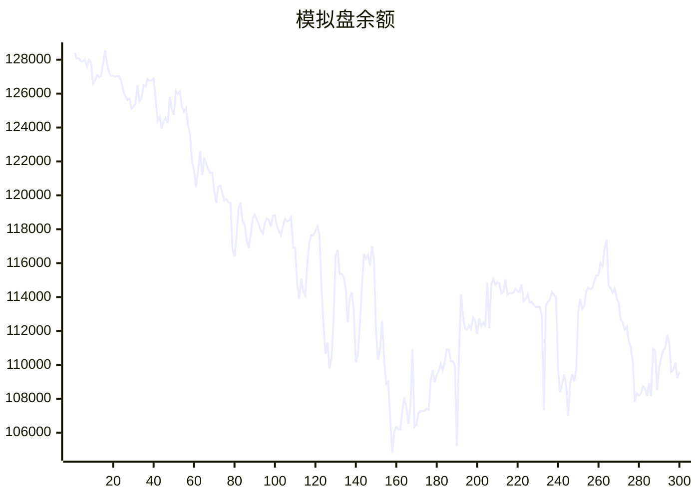

# 📈 AI模拟盘 自动交易报告

本项目利用 Github Action 定时运行 Claude Code，并结合MCP工具，实现在欧易模拟盘环境下自动交易。

```mermaid
xychart
    title "模拟盘余额"
    line [128412,128062,128087,127917,127901,128026,127611,128000,127850,126572,126770,127100,126971,127029,127783,128554,127765,127224,127064,127044,127009,127025,127004,126738,126152,125871,125635,125707,125117,125217,125420,126480,125545,125715,126511,126424,126856,126764,126788,126890,125710,124381,124632,123936,124402,124574,124256,125833,125070,124739,126154,125966,126145,125213,124943,125143,124157,123604,121959,121476,120476,121470,122610,121201,122221,121889,121522,121332,121344,120232,119559,120513,120577,120108,119680,119777,119572,119568,116839,116392,117573,119250,119585,118469,118277,117338,116897,117706,118628,118849,118579,118280,117926,117735,118373,118639,118544,118136,118798,118819,118162,117874,117649,118215,118601,118463,118517,118713,116911,116899,114798,113887,115084,114313,114091,115934,117221,117658,117658,117883,118164,117693,114632,112403,110644,111313,109777,110444,112673,116419,116772,115355,115355,115198,114476,112510,113954,114276,113223,110151,110561,112361,114562,116522,116265,116500,115845,117000,116199,111887,110306,110942,112588,110318,108891,109011,106814,104811,106038,106327,106201,106180,107315,108068,107463,106528,107530,110941,106346,106482,107161,107268,107270,107302,107426,107340,108985,109681,108962,109404,109645,110030,109680,110214,110918,110897,110215,110212,109962,105235,110525,114151,112895,112137,112083,112329,112094,112784,112613,111829,112734,112268,112496,112313,114832,112156,114730,115058,114728,114866,114804,114208,114302,115037,114128,114227,114228,114267,114494,114335,114299,114745,113746,113859,114148,113674,113711,113552,113416,113428,113415,112835,107322,113510,113702,113859,114295,114137,113998,109788,108386,108831,109422,108819,106999,108909,109453,109023,109688,113146,113888,113292,113491,114346,114542,114458,114525,114969,115274,115289,116025,115822,116842,117402,114660,114526,114275,114517,113959,113664,112661,112467,112089,112257,111376,111041,110141,107817,108319,108201,108299,108734,108598,108187,108900,108158,110943,110834,108524,109823,110421,110838,111000,111757,111248,109595,109694,110118,109210,109592]
```

## 资产明细
- **BTC**: $79283.1
- **ETH**: $29204.3
- **USDT**: $376.0
- **SOL**: $0.0

## 交易记录
- 2025-12-09T08:44:49.813583 - Buy 0.320509 ETH using 1000 USDT at 3120.03 USDT/ETH
- 2025-12-09T02:13:11.702445 - Bought 4.433 ETH at $3,112.98 for $13,800 USDT
- 2025-12-09T02:13:11.702442 - Sold 103.677 SOL at $133.35 for $13,825.30 USDT
- 2025-12-08T22:31:02.671009 - Buy 0.01 ETH with BTC via ETH-BTC pair, Order ID: 3111524166656331776
- 2025-12-08T20:39:26.249671 - Buy 0.087267 ETH with 0.1 BTC at price 0.03458 BTC/ETH
- 2025-12-08T18:48:29.142160 - Sell 20 SOL for ETH at 0.0435 ETH/SOL, order ID: 3111075016995246080
- 2025-12-08T13:05:43.202678 - 挂单买入0.005 ETH，使用0.000171 BTC，汇率0.0342 BTC/ETH
- 2025-12-08T13:05:43.202676 - 买入0.01 ETH，使用0.00034 BTC，汇率0.034 BTC/ETH
- 2025-12-08T13:05:43.202673 - 买入0.00019512 BTC，花费17.9 USDT，成交均价$91,735.3
- 2025-12-08T10:39:49.176627 - Bought 1.089652 ETH at $3,156.97 for 3,440 USDT

## MCP工具
- [mcp-aktools](https://github.com/aahl/mcp-aktools): 用于查询价格走势及行情
- [mcp-okx](https://github.com/aahl/mcp-okx): 用于获取欧易账户信息和下单
- [mcp-notify](https://github.com/aahl/mcp-notify): 用于推送分析结果到指定渠道(可选)
- [mcp-hooks](https://github.com/aahl/ai-trading/tree/main/mcp-hooks.py): 用于保存交易结果和更新Readme

## 相关链接
- https://t.me/s/mcpBtc
- [自动交易工作流配置文件](https://github.com/aahl/ai-trading/blob/main/.github/workflows/claude.yaml)
- [自动交易工作流运行记录](https://github.com/aahl/ai-trading/actions/workflows/claude.yaml)
- [智谱免费模型可用于 Claude Code](https://www.bigmodel.cn/invite?icode=EwilDKx13%2FhyODIyL%2BKabHHEaazDlIZGj9HxftzTbt4%3D)
- [GLM Coding Plan·限时优惠](https://www.bigmodel.cn/claude-code?ic=WTOWFVEJXH)
- [欧易模拟盘API接口申请](https://www.okx.com/zh-hans/help/how-can-i-do-spot-trading-with-the-jupyter-notebook)
