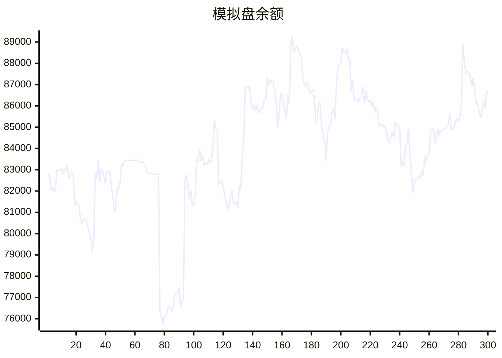

# 📈 AI模拟盘 自动交易报告

本项目利用 Github Action 定时运行 Claude Code，并结合MCP工具，实现在欧易模拟盘环境下自动交易。

```mermaid
xychart
    title "模拟盘余额"
    line [82778,82686,82056,82166,81963,82110,82951,82983,82984,83038,82838,82915,82998,83235,82642,82682,82858,82746,81396,81512,81362,81277,80600,80461,80699,80673,80616,80288,80038,79836,79142,79722,82837,82533,83480,82366,83032,82960,82654,82330,82883,82934,82901,82188,81728,81005,81298,82110,82135,82449,83264,83203,83440,83439,83440,83440,83446,83447,83448,83447,83448,83449,83369,83369,83369,83313,83256,82872,82873,82801,82844,82785,82791,82791,82793,82794,76339,76145,75714,76110,76096,76397,76594,76585,76310,76607,77160,77170,77160,77456,76541,76774,76927,82520,82744,82337,81639,82040,81307,81314,81887,83490,83414,83984,83396,83594,83261,83287,83253,83470,83327,83465,83987,85348,84930,84786,82355,82433,82438,82167,81795,81466,81105,81315,81756,82064,81426,81398,81481,81210,82242,82099,83658,84359,86925,86892,86814,86980,86203,85802,86003,85811,86028,85657,85721,85896,85880,86300,86299,87378,86965,87214,87115,87118,86780,86238,84966,85623,86555,86562,86129,85722,85387,86569,86070,88870,89278,88477,88720,88781,88668,88467,88372,87493,87018,86917,87102,86870,86613,86644,86758,86317,85242,85334,86149,86106,84968,84671,84302,83410,84816,85001,85127,85693,85891,85384,87001,87811,87945,88007,88734,88528,88495,88705,88189,88248,86662,87234,86279,86251,86314,86177,86364,86503,86886,86114,86731,86310,86176,86240,86017,86136,85685,85938,85749,85111,85044,85164,85016,85008,84824,84354,84287,84572,84745,84500,85234,85096,85095,84970,83180,83338,83157,84070,84309,84922,83667,82850,81924,82369,82552,82539,82695,82648,82962,82728,83619,83378,83710,83825,84819,84854,84917,84265,84527,84919,84668,84834,84850,84916,84981,85004,85131,85674,84891,84864,85019,85284,85393,85294,85538,85894,88904,88012,87567,87625,87568,87386,86920,87313,86737,86094,86143,85725,85437,85787,86219,85859,86526,86740]
```

## 资产明细
- **BTC**: $56465.4
- **ETH**: $16035.7
- **SOL**: $12406.7
- **USDT**: $1831.8

## 交易记录
- 2026-05-08T17:31:14.985561 - Buy 8.304728 SOL via SOL-USDT market order, spent 750 USDT at avg price 90.31; fee 0.008304728 SOL, net SOL added 8.296423272
- 2026-05-08T14:14:01.335273 - Buy 28.181715 SOL on SOL-USDT with 2500 USDT at average price 88.71 USDT; order filled.
- 2026-05-08T11:28:51.193073 - Buy 700 USDT of BTC at market on BTC-USDT, avg fill 80310.3 USDT, fee 0.00000871619 BTC, net +0.00870747381 BTC
- 2026-05-08T11:28:51.193071 - Buy 1100 USDT of SOL at market on SOL-USDT, gross fill 12.406947 SOL, fee 0.012406947 SOL, net +12.394540053 SOL
- 2026-05-08T11:28:51.193067 - Sell 0.349 ETH at market on ETH-USDT, avg fill 2294.16 USDT, fee 0.80066184 USDT
- 2026-05-08T09:50:22.777090 - Buy 0.657367 ETH at 2281.83 USDT via market order, spent 1500 USDT, fee 0.000657367 ETH
- 2026-05-08T06:09:27.694448 - Buy 11.367511 SOL on SOL-USDT at 87.97 USDT, spent 1000 USDT, fee 0.011367511 SOL, order 3547310251648229376
- 2026-05-07T19:52:39.048802 - Post-trade balances updated: BTC rose to 0.69629415624143 and USDT fell to 8582.332515846734.
- 2026-05-07T19:52:39.048801 - Order filled immediately at 80,194.1 for 0.0267476 BTC with fee 0.0000267476 BTC.
- 2026-05-07T19:52:39.048800 - Placed one conservative BTC-USDT spot market buy for 2,145 USDT under clOrdId agt260507btcusdt01.

## MCP工具
- [mcp-aktools](https://github.com/aahl/mcp-aktools): 用于查询价格走势及行情
- [mcp-okx](https://github.com/aahl/mcp-okx): 用于获取欧易账户信息和下单
- [mcp-notify](https://github.com/aahl/mcp-notify): 用于推送分析结果到指定渠道(可选)
- [mcp-hooks](https://github.com/aahl/ai-trading/tree/main/mcp-hooks.py): 用于保存交易结果和更新Readme

## 相关链接
- https://t.me/s/mcpBtc
- [自动交易工作流配置文件](https://github.com/aahl/ai-trading/blob/main/.github/workflows/claude.yaml)
- [自动交易工作流运行记录](https://github.com/aahl/ai-trading/actions/workflows/claude.yaml)
- [智谱免费模型可用于 Claude Code](https://www.bigmodel.cn/invite?icode=EwilDKx13%2FhyODIyL%2BKabHHEaazDlIZGj9HxftzTbt4%3D)
- [GLM Coding Plan·限时优惠](https://www.bigmodel.cn/claude-code?ic=WTOWFVEJXH)
- [欧易模拟盘API接口申请](https://www.okx.com/zh-hans/help/how-can-i-do-spot-trading-with-the-jupyter-notebook)
