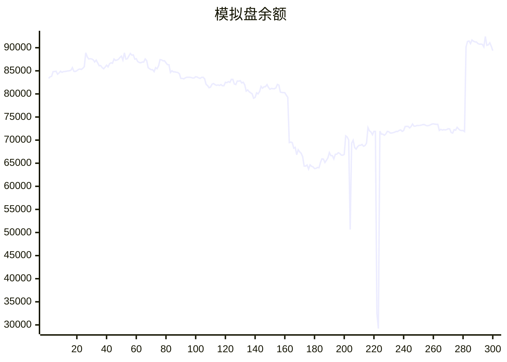

# 📈 AI模拟盘 自动交易报告

本项目利用 Github Action 定时运行 Claude Code，并结合MCP工具，实现在欧易模拟盘环境下自动交易。

```mermaid
xychart
    title "模拟盘余额"
    line [83378,83710,83825,84819,84854,84917,84265,84527,84919,84668,84834,84850,84916,84981,85004,85131,85674,84891,84864,85019,85284,85393,85294,85538,85894,88904,88012,87567,87625,87568,87386,86920,87313,86737,86094,86143,85725,85437,85787,86219,85859,86526,86740,86630,87563,87264,87335,87483,87886,88180,87335,88894,87544,87608,88207,88755,88401,88444,87543,87608,87000,86810,86740,86894,86884,87576,87209,85686,85435,85251,85255,84820,85689,85453,86066,87420,87373,87161,87178,86740,86341,86315,84643,85012,84772,84768,84690,84635,84376,83360,83357,83259,83474,83608,83606,83602,83548,83440,83454,83724,83644,83464,83365,83590,83592,83275,82072,81806,81344,81492,82109,82254,82006,81848,81955,81829,82022,81769,81776,82522,82441,82656,82498,83144,83144,82150,82038,82797,82763,82872,82367,82536,81981,80612,80862,80484,80242,80034,79063,79245,80226,80016,80507,81625,81233,81544,81578,82016,81401,81019,81186,81130,81118,81306,82066,81909,80392,80304,80291,80258,79729,79261,69466,69579,69456,68251,68415,66832,67911,67462,67144,66432,64380,64375,64606,63740,64647,64324,64216,63842,63877,64078,64008,65156,65945,65888,65157,65625,66144,67284,66653,66639,65924,66925,66956,67263,67108,66766,66729,66886,70927,70673,70049,50652,69334,69973,68400,68061,68578,68876,68879,69055,68662,68822,69329,72687,71999,71760,71162,71911,71896,32500,29218,71927,71297,71305,71044,71337,71883,71822,71536,71536,71622,71723,71880,71860,72100,72216,71887,72077,72940,72976,72966,72638,72948,73497,73004,73041,73173,73160,73186,73258,73375,73351,73173,73098,73161,73305,73474,73536,73457,73413,73412,72100,72333,72164,72272,72204,72285,72461,72421,71652,71521,72267,72157,72774,72424,72144,72060,72091,71858,90185,91338,91466,90900,91678,91404,91268,91244,90903,90779,90787,90721,90187,92429,90518,90619,91070,90328,89376]
```

## 资产明细
- **BTC**: $29348.7
- **ETH**: $31273.7
- **SOL**: $1271.1
- **USDT**: $27521.5

## 交易记录
- 2026-09-02T11:11:26.979934 - Buy ETH with 5000 USDT at avg price 2378.86, filled 2.101844 ETH (oversold RSI rebound entry)
- 2026-09-01T20:58:27.209650 - Sell 1.5 ETH at 2440 USDT, received ~3656 USDT, reduced ETH position to lock profits
- 2026-08-29T03:40:15.295450 - Place limit buy order 1.8 ETH @ 2415 USDT (pending, ~4.8% of equity) - ETH oversold near key support 2386
- 2026-08-28T20:12:32.099149 - Canceled pending limit sell order 23 SOL @ 108.2 USDT
- 2026-08-28T20:12:32.099146 - Sell 33.809 SOL at avg 103.39 USDT, received ~3496 USDT
- 2026-08-27T20:20:38.913435 - Placed limit sell order for 23 SOL at 108.2 USDT to reduce overbought SOL position (pending)
- 2026-08-27T20:20:38.913433 - Sold 0.17 BTC at 80,000.08 USDT to lock in ~19% profit (1/3 BTC position reduced)
- 2026-08-27T20:20:38.913430 - Canceled 2 SOL limit buy orders (buySOL0826A @95.5, buySOL0826B @94) to avoid chasing rally
- 2026-08-26T17:01:02.019246 - Place buySOL0826B limit buy 5 SOL @ 94.0 to build SOL position on dip
- 2026-08-26T17:01:02.019244 - Cancel buyETH0826B limit buy 1.5 ETH @ 2425 to reduce ETH concentration

## MCP工具
- [mcp-aktools](https://github.com/aahl/mcp-aktools): 用于查询价格走势及行情
- [mcp-okx](https://github.com/aahl/mcp-okx): 用于获取欧易账户信息和下单
- [mcp-notify](https://github.com/aahl/mcp-notify): 用于推送分析结果到指定渠道(可选)
- [mcp-hooks](https://github.com/aahl/ai-trading/tree/main/mcp-hooks.py): 用于保存交易结果和更新Readme

## 相关链接
- https://t.me/s/mcpBtc
- [自动交易工作流配置文件](https://github.com/aahl/ai-trading/blob/main/.github/workflows/claude.yaml)
- [自动交易工作流运行记录](https://github.com/aahl/ai-trading/actions/workflows/claude.yaml)
- [智谱免费模型可用于 Claude Code](https://www.bigmodel.cn/invite?icode=EwilDKx13%2FhyODIyL%2BKabHHEaazDlIZGj9HxftzTbt4%3D)
- [GLM Coding Plan·限时优惠](https://www.bigmodel.cn/claude-code?ic=WTOWFVEJXH)
- [欧易模拟盘API接口申请](https://www.okx.com/zh-hans/help/how-can-i-do-spot-trading-with-the-jupyter-notebook)
