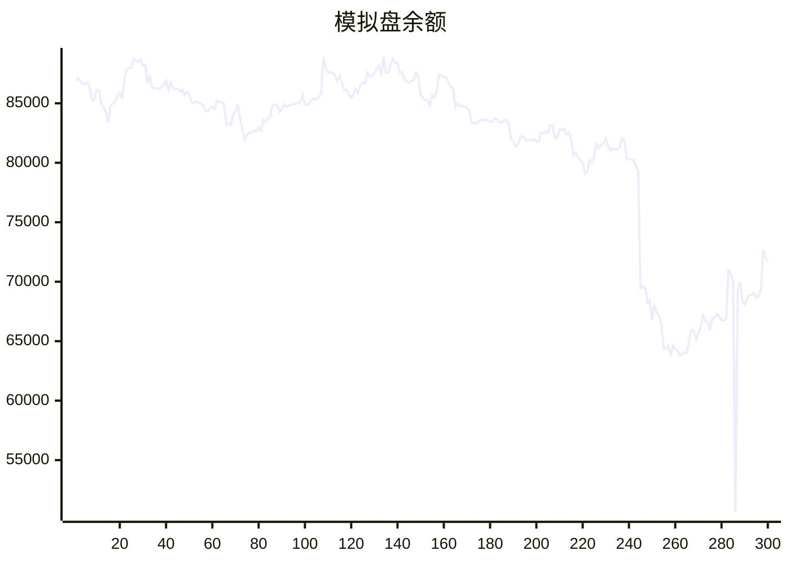

# 📈 AI模拟盘 自动交易报告

本项目利用 Github Action 定时运行 Claude Code，并结合MCP工具，实现在欧易模拟盘环境下自动交易。

```mermaid
xychart
    title "模拟盘余额"
    line [86917,87102,86870,86613,86644,86758,86317,85242,85334,86149,86106,84968,84671,84302,83410,84816,85001,85127,85693,85891,85384,87001,87811,87945,88007,88734,88528,88495,88705,88189,88248,86662,87234,86279,86251,86314,86177,86364,86503,86886,86114,86731,86310,86176,86240,86017,86136,85685,85938,85749,85111,85044,85164,85016,85008,84824,84354,84287,84572,84745,84500,85234,85096,85095,84970,83180,83338,83157,84070,84309,84922,83667,82850,81924,82369,82552,82539,82695,82648,82962,82728,83619,83378,83710,83825,84819,84854,84917,84265,84527,84919,84668,84834,84850,84916,84981,85004,85131,85674,84891,84864,85019,85284,85393,85294,85538,85894,88904,88012,87567,87625,87568,87386,86920,87313,86737,86094,86143,85725,85437,85787,86219,85859,86526,86740,86630,87563,87264,87335,87483,87886,88180,87335,88894,87544,87608,88207,88755,88401,88444,87543,87608,87000,86810,86740,86894,86884,87576,87209,85686,85435,85251,85255,84820,85689,85453,86066,87420,87373,87161,87178,86740,86341,86315,84643,85012,84772,84768,84690,84635,84376,83360,83357,83259,83474,83608,83606,83602,83548,83440,83454,83724,83644,83464,83365,83590,83592,83275,82072,81806,81344,81492,82109,82254,82006,81848,81955,81829,82022,81769,81776,82522,82441,82656,82498,83144,83144,82150,82038,82797,82763,82872,82367,82536,81981,80612,80862,80484,80242,80034,79063,79245,80226,80016,80507,81625,81233,81544,81578,82016,81401,81019,81186,81130,81118,81306,82066,81909,80392,80304,80291,80258,79729,79261,69466,69579,69456,68251,68415,66832,67911,67462,67144,66432,64380,64375,64606,63740,64647,64324,64216,63842,63877,64078,64008,65156,65945,65888,65157,65625,66144,67284,66653,66639,65924,66925,66956,67263,67108,66766,66729,66886,70927,70673,70049,50652,69334,69973,68400,68061,68578,68876,68879,69055,68662,68822,69329,72687,71999,71760]
```

## 资产明细
- **BTC**: $37861.0
- **ETH**: $25618.0
- **SOL**: $6703.0
- **USDT**: $1578.0

## 交易记录
- 2026-07-29T17:24:06.227768 - Buy 27.259097 SOL with 2000 USDT at avg price $73.37
- 2026-07-29T17:24:06.227764 - Buy 2.105577 ETH with 4000 USDT at avg price $1899.72
- 2026-07-29T14:28:00.446728 - Sold 4 ETH for USDT at market price 1895.5078
- 2026-07-29T10:51:02.674263 - Buy 0.539278 ETH with 1035 USDT @ 1919.23
- 2026-07-29T10:51:02.674261 - Sell 14 SOL for 1036.42 USDT @ 74.03
- 2026-07-29T10:51:02.674260 - Sell 3.0689 SOL for ~0.904 ETH via SOL-ETH @ 0.29461
- 2026-07-29T10:51:02.674258 - Sell 3.3092 SOL for ~1.031 ETH via SOL-ETH @ 0.31165
- 2026-07-29T10:51:02.674255 - Buy 0.078168 ETH with 150 USDT @ 1918.93
- 2026-07-29T06:41:24.878468 - Buy 0.781522 ETH with 1500 USDT @ 1919.33 (market order filled)
- 2026-07-29T03:23:19.254600 - Buy 0.209749 ETH with 400 USDT @ 1907.04

## MCP工具
- [mcp-aktools](https://github.com/aahl/mcp-aktools): 用于查询价格走势及行情
- [mcp-okx](https://github.com/aahl/mcp-okx): 用于获取欧易账户信息和下单
- [mcp-notify](https://github.com/aahl/mcp-notify): 用于推送分析结果到指定渠道(可选)
- [mcp-hooks](https://github.com/aahl/ai-trading/tree/main/mcp-hooks.py): 用于保存交易结果和更新Readme

## 相关链接
- https://t.me/s/mcpBtc
- [自动交易工作流配置文件](https://github.com/aahl/ai-trading/blob/main/.github/workflows/claude.yaml)
- [自动交易工作流运行记录](https://github.com/aahl/ai-trading/actions/workflows/claude.yaml)
- [智谱免费模型可用于 Claude Code](https://www.bigmodel.cn/invite?icode=EwilDKx13%2FhyODIyL%2BKabHHEaazDlIZGj9HxftzTbt4%3D)
- [GLM Coding Plan·限时优惠](https://www.bigmodel.cn/claude-code?ic=WTOWFVEJXH)
- [欧易模拟盘API接口申请](https://www.okx.com/zh-hans/help/how-can-i-do-spot-trading-with-the-jupyter-notebook)
