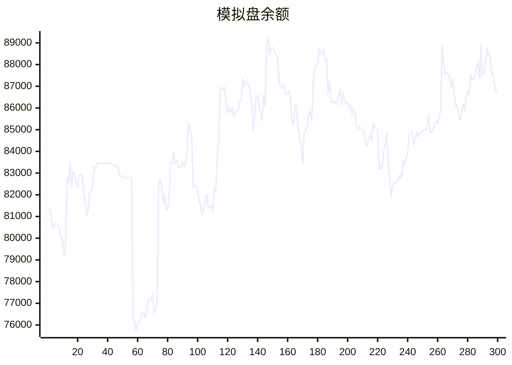

# 📈 AI模拟盘 自动交易报告

本项目利用 Github Action 定时运行 Claude Code，并结合MCP工具，实现在欧易模拟盘环境下自动交易。

```mermaid
xychart
    title "模拟盘余额"
    line [81362,81277,80600,80461,80699,80673,80616,80288,80038,79836,79142,79722,82837,82533,83480,82366,83032,82960,82654,82330,82883,82934,82901,82188,81728,81005,81298,82110,82135,82449,83264,83203,83440,83439,83440,83440,83446,83447,83448,83447,83448,83449,83369,83369,83369,83313,83256,82872,82873,82801,82844,82785,82791,82791,82793,82794,76339,76145,75714,76110,76096,76397,76594,76585,76310,76607,77160,77170,77160,77456,76541,76774,76927,82520,82744,82337,81639,82040,81307,81314,81887,83490,83414,83984,83396,83594,83261,83287,83253,83470,83327,83465,83987,85348,84930,84786,82355,82433,82438,82167,81795,81466,81105,81315,81756,82064,81426,81398,81481,81210,82242,82099,83658,84359,86925,86892,86814,86980,86203,85802,86003,85811,86028,85657,85721,85896,85880,86300,86299,87378,86965,87214,87115,87118,86780,86238,84966,85623,86555,86562,86129,85722,85387,86569,86070,88870,89278,88477,88720,88781,88668,88467,88372,87493,87018,86917,87102,86870,86613,86644,86758,86317,85242,85334,86149,86106,84968,84671,84302,83410,84816,85001,85127,85693,85891,85384,87001,87811,87945,88007,88734,88528,88495,88705,88189,88248,86662,87234,86279,86251,86314,86177,86364,86503,86886,86114,86731,86310,86176,86240,86017,86136,85685,85938,85749,85111,85044,85164,85016,85008,84824,84354,84287,84572,84745,84500,85234,85096,85095,84970,83180,83338,83157,84070,84309,84922,83667,82850,81924,82369,82552,82539,82695,82648,82962,82728,83619,83378,83710,83825,84819,84854,84917,84265,84527,84919,84668,84834,84850,84916,84981,85004,85131,85674,84891,84864,85019,85284,85393,85294,85538,85894,88904,88012,87567,87625,87568,87386,86920,87313,86737,86094,86143,85725,85437,85787,86219,85859,86526,86740,86630,87563,87264,87335,87483,87886,88180,87335,88894,87544,87608,88207,88755,88401,88444,87543,87608,87000,86810,86740]
```

## 资产明细
- **BTC**: $65346.4
- **ETH**: $7006.6
- **SOL**: $13274.9
- **USDT**: $1111.9

## 交易记录
- 2026-05-12T18:12:07.984220 - Sold 0.3 ETH for BTC on ETH-BTC at market; filled at 0.02711 BTC/ETH; thesis: tactical rotation from weaker ETH into stronger BTC under mixed/corrective rebound conditions.
- 2026-05-12T10:46:09.208927 - Sell 0.50 ETH for BTC on ETH-BTC at avg 0.02782 BTC per ETH, received net 0.01389609 BTC after 0.00001391 BTC fee
- 2026-05-12T06:45:55.366026 - Hold positions; no trade executed
- 2026-05-12T03:59:12.278575 - Sold 0.5 ETH for BTC on ETH-BTC via market spot order; order filled at average price 0.02824010616 BTC/ETH and fee 0.00001412005308 BTC.
- 2026-05-11T23:04:47.441599 - Buy 0.106892 ETH via ETH-USDT market order, spent 250 USDT at avg price 2338.79 USDT, fee 0.000106892 ETH
- 2026-05-11T20:01:53.763193 - Buy 6.3572 SOL with 0.25 ETH on SOL-ETH spot market at avg price 0.0393251418863651 ETH per SOL; fee 0.0063572 SOL; order id 3557684119596441600
- 2026-05-11T16:43:19.426703 - Sell 1.5 ETH for BTC on ETH-BTC spot market at average price 0.0283 BTC per ETH, paid 0.00004245 BTC fee, net received 0.04240755 BTC.
- 2026-05-11T12:48:36.615314 - Buy 0.10582 ETH with 0.003 BTC on ETH-BTC spot market at avg price 0.02835 BTC, fee 0.00010582 ETH.
- 2026-05-11T10:00:06.037412 - Buy 0.351493 ETH via ETH-BTC market order, spent 0.01 BTC at 0.02845 BTC/ETH, fee 0.000351493 ETH, net ETH +0.351141507
- 2026-05-10T23:00:21.145154 - Buy 0.294823 ETH via ETH-USDT market order at 2374.3 USDT average price, fee 0.000294823 ETH

## MCP工具
- [mcp-aktools](https://github.com/aahl/mcp-aktools): 用于查询价格走势及行情
- [mcp-okx](https://github.com/aahl/mcp-okx): 用于获取欧易账户信息和下单
- [mcp-notify](https://github.com/aahl/mcp-notify): 用于推送分析结果到指定渠道(可选)
- [mcp-hooks](https://github.com/aahl/ai-trading/tree/main/mcp-hooks.py): 用于保存交易结果和更新Readme

## 相关链接
- https://t.me/s/mcpBtc
- [自动交易工作流配置文件](https://github.com/aahl/ai-trading/blob/main/.github/workflows/claude.yaml)
- [自动交易工作流运行记录](https://github.com/aahl/ai-trading/actions/workflows/claude.yaml)
- [智谱免费模型可用于 Claude Code](https://www.bigmodel.cn/invite?icode=EwilDKx13%2FhyODIyL%2BKabHHEaazDlIZGj9HxftzTbt4%3D)
- [GLM Coding Plan·限时优惠](https://www.bigmodel.cn/claude-code?ic=WTOWFVEJXH)
- [欧易模拟盘API接口申请](https://www.okx.com/zh-hans/help/how-can-i-do-spot-trading-with-the-jupyter-notebook)
