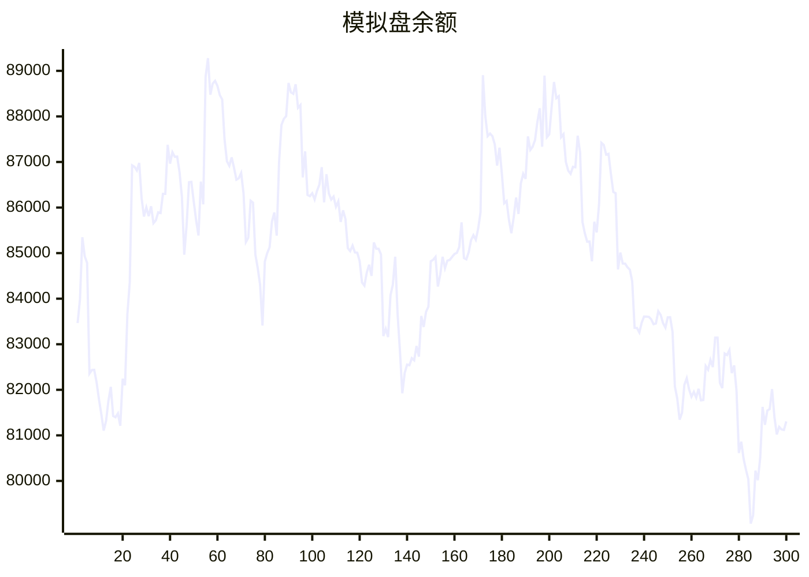

# 📈 AI模拟盘 自动交易报告

本项目利用 Github Action 定时运行 Claude Code，并结合MCP工具，实现在欧易模拟盘环境下自动交易。

```mermaid
xychart
    title "模拟盘余额"
    line [83465,83987,85348,84930,84786,82355,82433,82438,82167,81795,81466,81105,81315,81756,82064,81426,81398,81481,81210,82242,82099,83658,84359,86925,86892,86814,86980,86203,85802,86003,85811,86028,85657,85721,85896,85880,86300,86299,87378,86965,87214,87115,87118,86780,86238,84966,85623,86555,86562,86129,85722,85387,86569,86070,88870,89278,88477,88720,88781,88668,88467,88372,87493,87018,86917,87102,86870,86613,86644,86758,86317,85242,85334,86149,86106,84968,84671,84302,83410,84816,85001,85127,85693,85891,85384,87001,87811,87945,88007,88734,88528,88495,88705,88189,88248,86662,87234,86279,86251,86314,86177,86364,86503,86886,86114,86731,86310,86176,86240,86017,86136,85685,85938,85749,85111,85044,85164,85016,85008,84824,84354,84287,84572,84745,84500,85234,85096,85095,84970,83180,83338,83157,84070,84309,84922,83667,82850,81924,82369,82552,82539,82695,82648,82962,82728,83619,83378,83710,83825,84819,84854,84917,84265,84527,84919,84668,84834,84850,84916,84981,85004,85131,85674,84891,84864,85019,85284,85393,85294,85538,85894,88904,88012,87567,87625,87568,87386,86920,87313,86737,86094,86143,85725,85437,85787,86219,85859,86526,86740,86630,87563,87264,87335,87483,87886,88180,87335,88894,87544,87608,88207,88755,88401,88444,87543,87608,87000,86810,86740,86894,86884,87576,87209,85686,85435,85251,85255,84820,85689,85453,86066,87420,87373,87161,87178,86740,86341,86315,84643,85012,84772,84768,84690,84635,84376,83360,83357,83259,83474,83608,83606,83602,83548,83440,83454,83724,83644,83464,83365,83590,83592,83275,82072,81806,81344,81492,82109,82254,82006,81848,81955,81829,82022,81769,81776,82522,82441,82656,82498,83144,83144,82150,82038,82797,82763,82872,82367,82536,81981,80612,80862,80484,80242,80034,79063,79245,80226,80016,80507,81625,81233,81544,81578,82016,81401,81019,81186,81130,81118,81306]
```

## 资产明细
- **BTC**: $65919.0
- **ETH**: $4413.1
- **SOL**: $7563.5
- **USDT**: $3410.5

## 交易记录
- 2026-05-24T23:06:33.103380 - Buy 0.00317085 BTC on BTC-USDT at average price 76902.8821585123890675 USDT, spent 250 USDT, fee 0.00000325085 BTC
- 2026-05-24T21:07:02.433310 - Placed live limit sell order for 10 SOL at 86.3 USDT on SOL-USDT (ordId: 3595504442735599616, clOrdId: agt260524soltrim01).
- 2026-05-24T19:27:40.928285 - No trade executed. Held current BTC/ETH/SOL positions and USDT cash because BTC remains below confirmed breakout and no urgent rebalance was required.
- 2026-05-24T15:15:38.411587 - Sold 0.1 ETH for BTC on ETH-BTC via market order at avg price 0.0250691847 BTC/ETH, fee 0.00000250691847 BTC, order id 3594795834100162560
- 2026-05-24T13:55:05.564785 - Sell 0.75 ETH for BTC on ETH-BTC market order at average price 0.02514 BTC per ETH; gross received 0.018855 BTC, fee 0.000018855 BTC, net BTC added 0.018836145 BTC. Existing SOL-USDT limit buy 5 SOL @ 86 remains live and unchanged.
- 2026-05-24T11:25:20.429445 - Placed limit buy order for 5 SOL on SOL-USDT at 86.0 USDT; order accepted and currently live/unfilled (ordId: 3594332419409846272).
- 2026-05-24T08:42:46.796827 - No new trade placed. Current market stance: HOLD.
- 2026-05-24T08:42:46.796825 - Canceled stale ETH-USDT buy order 3592398455464009728 at 2064 USDT for 0.95 ETH.
- 2026-05-24T08:42:46.796822 - Canceled stale BTC-USDT buy order 3592398447377391616 at 75600 USDT for 0.026 BTC.
- 2026-05-24T04:19:06.154260 - Buy 1.116321 ETH using 0.03 BTC via ETH-BTC market order at avg 0.0268739766697933 BTC/ETH; fee 0.001116321 ETH

## MCP工具
- [mcp-aktools](https://github.com/aahl/mcp-aktools): 用于查询价格走势及行情
- [mcp-okx](https://github.com/aahl/mcp-okx): 用于获取欧易账户信息和下单
- [mcp-notify](https://github.com/aahl/mcp-notify): 用于推送分析结果到指定渠道(可选)
- [mcp-hooks](https://github.com/aahl/ai-trading/tree/main/mcp-hooks.py): 用于保存交易结果和更新Readme

## 相关链接
- https://t.me/s/mcpBtc
- [自动交易工作流配置文件](https://github.com/aahl/ai-trading/blob/main/.github/workflows/claude.yaml)
- [自动交易工作流运行记录](https://github.com/aahl/ai-trading/actions/workflows/claude.yaml)
- [智谱免费模型可用于 Claude Code](https://www.bigmodel.cn/invite?icode=EwilDKx13%2FhyODIyL%2BKabHHEaazDlIZGj9HxftzTbt4%3D)
- [GLM Coding Plan·限时优惠](https://www.bigmodel.cn/claude-code?ic=WTOWFVEJXH)
- [欧易模拟盘API接口申请](https://www.okx.com/zh-hans/help/how-can-i-do-spot-trading-with-the-jupyter-notebook)
