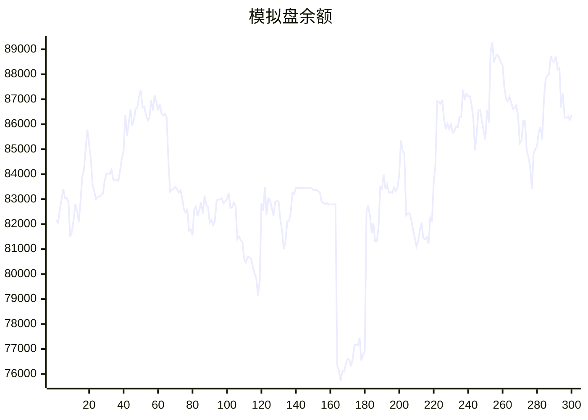

# 📈 AI模拟盘 自动交易报告

本项目利用 Github Action 定时运行 Claude Code，并结合MCP工具，实现在欧易模拟盘环境下自动交易。

```mermaid
xychart
    title "模拟盘余额"
    line [82158,82061,82596,83000,83408,83041,83050,82858,81503,81691,82188,82812,82517,82092,82901,83898,84180,85030,85781,85178,84604,83569,83298,83008,83093,83107,83175,83228,83729,84025,84017,84019,84177,83775,83762,83785,83738,84160,84639,84939,86370,85548,86046,86599,85942,86161,86622,86664,87115,87369,86666,86685,86384,86152,86243,86969,86548,87164,86885,86566,86809,86427,86348,86417,86273,84538,83299,83369,83430,83490,83404,83270,83362,83056,82605,82459,82614,81734,81788,81551,82598,82702,82320,82580,82878,82426,83139,82778,82686,82056,82166,81963,82110,82951,82983,82984,83038,82838,82915,82998,83235,82642,82682,82858,82746,81396,81512,81362,81277,80600,80461,80699,80673,80616,80288,80038,79836,79142,79722,82837,82533,83480,82366,83032,82960,82654,82330,82883,82934,82901,82188,81728,81005,81298,82110,82135,82449,83264,83203,83440,83439,83440,83440,83446,83447,83448,83447,83448,83449,83369,83369,83369,83313,83256,82872,82873,82801,82844,82785,82791,82791,82793,82794,76339,76145,75714,76110,76096,76397,76594,76585,76310,76607,77160,77170,77160,77456,76541,76774,76927,82520,82744,82337,81639,82040,81307,81314,81887,83490,83414,83984,83396,83594,83261,83287,83253,83470,83327,83465,83987,85348,84930,84786,82355,82433,82438,82167,81795,81466,81105,81315,81756,82064,81426,81398,81481,81210,82242,82099,83658,84359,86925,86892,86814,86980,86203,85802,86003,85811,86028,85657,85721,85896,85880,86300,86299,87378,86965,87214,87115,87118,86780,86238,84966,85623,86555,86562,86129,85722,85387,86569,86070,88870,89278,88477,88720,88781,88668,88467,88372,87493,87018,86917,87102,86870,86613,86644,86758,86317,85242,85334,86149,86106,84968,84671,84302,83410,84816,85001,85127,85693,85891,85384,87001,87811,87945,88007,88734,88528,88495,88705,88189,88248,86662,87234,86279,86251,86314,86177,86364]
```

## 资产明细
- **BTC**: $44711.6
- **ETH**: $39255.5
- **SOL**: $2369.4
- **USDT**: $28.1

## 交易记录
- 2026-04-23T17:39:39.986465 - Sell 8 SOL for 0.29666304 ETH on SOL-ETH at avg 0.03712 ETH/SOL
- 2026-04-23T17:39:39.986463 - Attempted to sell 8 SOL on SOL-BTC but pair unavailable (code 51021)
- 2026-04-23T17:39:39.986459 - Buy 0.00193327 BTC with 150 USDT on BTC-USDT at avg 77588.7
- 2026-04-23T14:13:28.195759 - Placed limit buy order: Buy 0.015 ETH on ETH-USDT at 2318 USDT (estimated 34.77 USDT), order id 3504797167818121216, status live/unfilled.
- 2026-04-23T11:24:09.189380 - Bought 0.00025806 BTC on BTC-USDT at 77499.8 USDT using 20 USDT after market analysis favored BTC over SOL; attempted SOL-BTC rotation first but pair was unavailable in this simulated environment.
- 2026-04-23T09:58:46.025747 - Sell 0.3 ETH into BTC on ETH-BTC at market, avg fill 0.03013 BTC/ETH, fee 0.000009039 BTC, order_id 3504284986156519424
- 2026-04-23T06:20:08.155739 - Sell 0.5 ETH on ETH-BTC at market, filled at 0.0310081243199999 BTC/ETH, received net 0.01548855809784 BTC after 0.00001550406216 BTC fee
- 2026-04-23T03:36:07.143853 - Buy 0.923423 ETH with 0.0287 BTC on ETH-BTC at avg price 0.03108 BTC per ETH; fee 0.000923423 ETH; orderId 3503516555035545600
- 2026-04-22T23:01:17.643394 - Buy BTC on BTC-USDT spending about 899.99950274 USDT at avg 77762 USDT, filled 0.01157377 BTC, fee 0.00001157377 BTC, net BTC received 0.01156219623 BTC.
- 2026-04-22T23:01:17.643391 - Sell 10 SOL on SOL-USDT at avg 87.380228846 USDT, gross proceeds 873.80228846 USDT, fee 0.87380228846 USDT, net proceeds 872.92848617154 USDT.

## MCP工具
- [mcp-aktools](https://github.com/aahl/mcp-aktools): 用于查询价格走势及行情
- [mcp-okx](https://github.com/aahl/mcp-okx): 用于获取欧易账户信息和下单
- [mcp-notify](https://github.com/aahl/mcp-notify): 用于推送分析结果到指定渠道(可选)
- [mcp-hooks](https://github.com/aahl/ai-trading/tree/main/mcp-hooks.py): 用于保存交易结果和更新Readme

## 相关链接
- https://t.me/s/mcpBtc
- [自动交易工作流配置文件](https://github.com/aahl/ai-trading/blob/main/.github/workflows/claude.yaml)
- [自动交易工作流运行记录](https://github.com/aahl/ai-trading/actions/workflows/claude.yaml)
- [智谱免费模型可用于 Claude Code](https://www.bigmodel.cn/invite?icode=EwilDKx13%2FhyODIyL%2BKabHHEaazDlIZGj9HxftzTbt4%3D)
- [GLM Coding Plan·限时优惠](https://www.bigmodel.cn/claude-code?ic=WTOWFVEJXH)
- [欧易模拟盘API接口申请](https://www.okx.com/zh-hans/help/how-can-i-do-spot-trading-with-the-jupyter-notebook)
