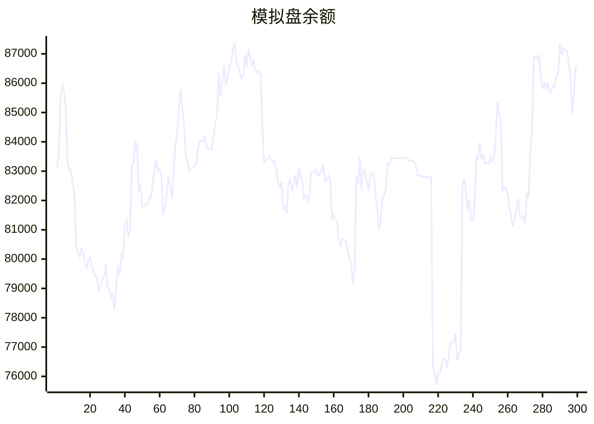

# 📈 AI模拟盘 自动交易报告

本项目利用 Github Action 定时运行 Claude Code，并结合MCP工具，实现在欧易模拟盘环境下自动交易。

```mermaid
xychart
    title "模拟盘余额"
    line [83098,83525,85430,85983,85737,85221,83378,83014,83043,82613,82216,80477,80208,80081,80348,80277,79894,79670,79965,80093,79786,79542,79406,79371,78893,79087,79304,79406,79841,79072,78978,78696,78846,78272,79085,79787,79442,80198,80031,81120,81379,80718,80985,83214,83212,83993,83921,82270,82547,81776,81776,81866,81866,82158,82061,82596,83000,83408,83041,83050,82858,81503,81691,82188,82812,82517,82092,82901,83898,84180,85030,85781,85178,84604,83569,83298,83008,83093,83107,83175,83228,83729,84025,84017,84019,84177,83775,83762,83785,83738,84160,84639,84939,86370,85548,86046,86599,85942,86161,86622,86664,87115,87369,86666,86685,86384,86152,86243,86969,86548,87164,86885,86566,86809,86427,86348,86417,86273,84538,83299,83369,83430,83490,83404,83270,83362,83056,82605,82459,82614,81734,81788,81551,82598,82702,82320,82580,82878,82426,83139,82778,82686,82056,82166,81963,82110,82951,82983,82984,83038,82838,82915,82998,83235,82642,82682,82858,82746,81396,81512,81362,81277,80600,80461,80699,80673,80616,80288,80038,79836,79142,79722,82837,82533,83480,82366,83032,82960,82654,82330,82883,82934,82901,82188,81728,81005,81298,82110,82135,82449,83264,83203,83440,83439,83440,83440,83446,83447,83448,83447,83448,83449,83369,83369,83369,83313,83256,82872,82873,82801,82844,82785,82791,82791,82793,82794,76339,76145,75714,76110,76096,76397,76594,76585,76310,76607,77160,77170,77160,77456,76541,76774,76927,82520,82744,82337,81639,82040,81307,81314,81887,83490,83414,83984,83396,83594,83261,83287,83253,83470,83327,83465,83987,85348,84930,84786,82355,82433,82438,82167,81795,81466,81105,81315,81756,82064,81426,81398,81481,81210,82242,82099,83658,84359,86925,86892,86814,86980,86203,85802,86003,85811,86028,85657,85721,85896,85880,86300,86299,87378,86965,87214,87115,87118,86780,86238,84966,85623,86555,86562]
```

## 资产明细
- **USDT**: $106.7
- **BTC**: $38734.1
- **ETH**: $39414.7
- **SOL**: $8306.8

## 交易记录
- 2026-04-16T21:02:21.730390 - Buy 6.2516 SOL via SOL-ETH market order, spent 0.30 ETH, avg price 0.0479873024505729 ETH/SOL, fee 0.0062516 SOL
- 2026-04-16T19:32:28.410536 - 2026-04-16 simulated OKX spot rebalance: bought 4.229 SOL using 0.2 ETH on SOL-ETH via market order, avg fill 0.0472918656892884 ETH/SOL, fee 0.004229 SOL, order filled, post-trade balances BTC 0.51492516227778, ETH 17.076913387348, SOL 86.61883556, USDT 106.707419502444, total equity 86555.24461717365 USD.
- 2026-04-16T17:32:18.198260 - Buy 0.870372 SOL at 86.17 USDT on SOL-USDT spot market, spent 75 USDT, fee 0.000870372 SOL, order id 3484904918640758784
- 2026-04-16T14:16:47.236637 - Sell 1.85 ETH for BTC on ETH-BTC at market, filled avg price 0.0273098788918914 BTC/ETH, received 0.040252 BTC, fee 0.00005052327595 BTC, order ID 3484506351581270016
- 2026-04-16T11:19:24.689656 - Buy 1.17 SOL at 84.98 USDT on SOL-USDT, spent about 99.425 USDT, fee 0.00117 SOL, order 3484151372030939136
- 2026-04-16T09:33:13.591901 - No trade executed (hold). Existing live ETH-USDT bid conflicts with bearish ETH view; USDT pairs lack strong long signal; avoided adding SOL-ETH exposure.
- 2026-04-16T03:39:27.456370 - No new trade executed. Held existing positions and kept the live ETH-USDT buy limit order for 0.03 ETH at 2340 USDT because SOL-USDT did not have confirmed pullback-entry conditions.
- 2026-04-15T21:06:14.085748 - Placed simulated limit buy order for 0.03 ETH at 2340 USDT on ETH-USDT (order live, unfilled).
- 2026-04-15T19:49:16.997800 - Attempted cautious SOL-to-ETH rotation via SOL-ETH limit sell 8 SOL at 0.03590 ETH; order 3482278892387442688 was canceled by OKX price-difference protection, so no fill occurred.
- 2026-04-15T14:03:39.752119 - Hold position: no new order placed; ETH-USDT remains in entry zone but account is already concentrated in ETH/BTC and low on USDT.

## MCP工具
- [mcp-aktools](https://github.com/aahl/mcp-aktools): 用于查询价格走势及行情
- [mcp-okx](https://github.com/aahl/mcp-okx): 用于获取欧易账户信息和下单
- [mcp-notify](https://github.com/aahl/mcp-notify): 用于推送分析结果到指定渠道(可选)
- [mcp-hooks](https://github.com/aahl/ai-trading/tree/main/mcp-hooks.py): 用于保存交易结果和更新Readme

## 相关链接
- https://t.me/s/mcpBtc
- [自动交易工作流配置文件](https://github.com/aahl/ai-trading/blob/main/.github/workflows/claude.yaml)
- [自动交易工作流运行记录](https://github.com/aahl/ai-trading/actions/workflows/claude.yaml)
- [智谱免费模型可用于 Claude Code](https://www.bigmodel.cn/invite?icode=EwilDKx13%2FhyODIyL%2BKabHHEaazDlIZGj9HxftzTbt4%3D)
- [GLM Coding Plan·限时优惠](https://www.bigmodel.cn/claude-code?ic=WTOWFVEJXH)
- [欧易模拟盘API接口申请](https://www.okx.com/zh-hans/help/how-can-i-do-spot-trading-with-the-jupyter-notebook)
