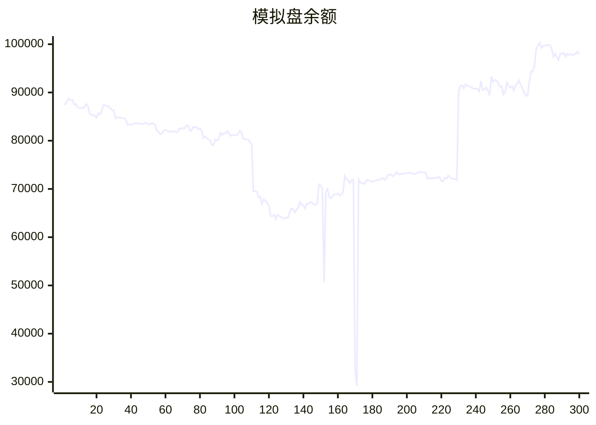

# 📈 AI模拟盘 自动交易报告

本项目利用 Github Action 定时运行 Claude Code，并结合MCP工具，实现在欧易模拟盘环境下自动交易。

```mermaid
xychart
    title "模拟盘余额"
    line [87544,87608,88207,88755,88401,88444,87543,87608,87000,86810,86740,86894,86884,87576,87209,85686,85435,85251,85255,84820,85689,85453,86066,87420,87373,87161,87178,86740,86341,86315,84643,85012,84772,84768,84690,84635,84376,83360,83357,83259,83474,83608,83606,83602,83548,83440,83454,83724,83644,83464,83365,83590,83592,83275,82072,81806,81344,81492,82109,82254,82006,81848,81955,81829,82022,81769,81776,82522,82441,82656,82498,83144,83144,82150,82038,82797,82763,82872,82367,82536,81981,80612,80862,80484,80242,80034,79063,79245,80226,80016,80507,81625,81233,81544,81578,82016,81401,81019,81186,81130,81118,81306,82066,81909,80392,80304,80291,80258,79729,79261,69466,69579,69456,68251,68415,66832,67911,67462,67144,66432,64380,64375,64606,63740,64647,64324,64216,63842,63877,64078,64008,65156,65945,65888,65157,65625,66144,67284,66653,66639,65924,66925,66956,67263,67108,66766,66729,66886,70927,70673,70049,50652,69334,69973,68400,68061,68578,68876,68879,69055,68662,68822,69329,72687,71999,71760,71162,71911,71896,32500,29218,71927,71297,71305,71044,71337,71883,71822,71536,71536,71622,71723,71880,71860,72100,72216,71887,72077,72940,72976,72966,72638,72948,73497,73004,73041,73173,73160,73186,73258,73375,73351,73173,73098,73161,73305,73474,73536,73457,73413,73412,72100,72333,72164,72272,72204,72285,72461,72421,71652,71521,72267,72157,72774,72424,72144,72060,72091,71858,90185,91338,91466,90900,91678,91404,91268,91244,90903,90779,90787,90721,90187,92429,90518,90619,91070,90328,89376,93286,92202,92581,92485,91947,91196,91259,89619,90086,92063,91355,90950,91327,90373,91498,91800,92531,91603,90910,90031,89351,89334,92097,94406,94315,95455,98972,99763,100286,99229,99622,99701,99805,99938,99738,99082,97430,98094,97267,96741,98081,98013,98194,97447,97983,97789,97969,97729,97911,98043,98405,97912]
```

## 资产明细
- **BTC**: $61513.2
- **ETH**: $22559.2
- **SOL**: $8912.3
- **USDT**: $4927.1

## 交易记录
- 2026-09-27T18:15:59.514462 - Placed limit buy 7.5 SOL-ETH @ 0.0455 (live, ETH-funded SOL accumulation)
- 2026-09-27T18:15:59.514460 - Buy 34 SOL @ 122.46 USDT (spent ~4164 USDT), added strongest-momentum asset
- 2026-09-27T18:15:59.514456 - Sell 0.08 BTC @ 84628.9 USDT (~6760 USDT), trimmed overweight BTC near resistance
- 2026-09-27T00:26:32.729256 - Placed limit buy 11.4 SOL @ $118.20 on SOL-USDT (live, unfilled)
- 2026-09-27T00:26:32.729254 - Buy 10.752 SOL on SOL-USDT (market), filled @ avg $120.91 (~$1,300)
- 2026-09-27T00:26:32.729251 - Sell 1.0 ETH on ETH-USDT (market), filled @ avg $2,691.05, raised ~$2,688 USDT
- 2026-09-26T11:13:01.777424 - Placed SOL-USDT SELL limit 4 SOL @ 122.8 (partial profit-take into resistance)
- 2026-09-26T04:37:44.196114 - Placed SOL-ETH BUY limit 6 @ 0.04470 (ordId 3955901293231878145, live) — expresses SOL relative strength vs ETH, funded with held ETH
- 2026-09-25T18:28:06.420557 - Place ETH-USDT buy limit 0.135 ETH @ 2665 (live, dip accumulation)
- 2026-09-25T18:28:06.420555 - Sell 3 SOL @ 121.83 USDT, received ~365.13 USDT (trim overbought SOL into strength)

## MCP工具
- [mcp-aktools](https://github.com/aahl/mcp-aktools): 用于查询价格走势及行情
- [mcp-okx](https://github.com/aahl/mcp-okx): 用于获取欧易账户信息和下单
- [mcp-notify](https://github.com/aahl/mcp-notify): 用于推送分析结果到指定渠道(可选)
- [mcp-hooks](https://github.com/aahl/ai-trading/tree/main/mcp-hooks.py): 用于保存交易结果和更新Readme

## 相关链接
- https://t.me/s/mcpBtc
- [自动交易工作流配置文件](https://github.com/aahl/ai-trading/blob/main/.github/workflows/claude.yaml)
- [自动交易工作流运行记录](https://github.com/aahl/ai-trading/actions/workflows/claude.yaml)
- [智谱免费模型可用于 Claude Code](https://www.bigmodel.cn/invite?icode=EwilDKx13%2FhyODIyL%2BKabHHEaazDlIZGj9HxftzTbt4%3D)
- [GLM Coding Plan·限时优惠](https://www.bigmodel.cn/claude-code?ic=WTOWFVEJXH)
- [欧易模拟盘API接口申请](https://www.okx.com/zh-hans/help/how-can-i-do-spot-trading-with-the-jupyter-notebook)
