# 📈 AI模拟盘 自动交易报告

本项目利用 Github Action 定时运行 Claude Code，并结合MCP工具，实现在欧易模拟盘环境下自动交易。

```mermaid
xychart
    title "模拟盘余额"
    line [123338,123402,123530,123592,123378,123745,123413,123853,123009,123040,122557,121938,122095,122599,122856,122597,122898,123160,123319,122719,122087,122454,122416,122685,122592,122907,122961,122776,122981,123295,123507,124403,125224,124894,125303,126088,126544,126534,126549,128335,128318,128318,128318,128318,128318,128424,128424,128424,128424,128424,128424,128424,128424,128424,128247,128412,128062,128087,127917,127901,128026,127611,128000,127850,126572,126770,127100,126971,127029,127783,128554,127765,127224,127064,127044,127009,127025,127004,126738,126152,125871,125635,125707,125117,125217,125420,126480,125545,125715,126511,126424,126856,126764,126788,126890,125710,124381,124632,123936,124402,124574,124256,125833,125070,124739,126154,125966,126145,125213,124943,125143,124157,123604,121959,121476,120476,121470,122610,121201,122221,121889,121522,121332,121344,120232,119559,120513,120577,120108,119680,119777,119572,119568,116839,116392,117573,119250,119585,118469,118277,117338,116897,117706,118628,118849,118579,118280,117926,117735,11802,118373,118639,118544,118136]
```

## 资产明细
- **BTC**: $52084.7
- **ETH**: $30317.5
- **SOL**: $23183.2
- **USDT**: $12591.6

## 交易记录
- 2025-11-15T16:24:16.632059 - ETH-USDT: BUY recommended at $3,168 (0.1 ETH) - insufficient USDT available
- 2025-11-15T16:24:16.632056 - BTC-USDT: BUY recommended at $96,250 (0.05 BTC) - insufficient USDT available
- 2025-11-15T15:19:32.937247 - SOL-USD strong fundamentals with DApp revenue growth; ETF inflows 14-day $382M; whale accumulation
- 2025-11-15T15:19:32.937245 - ETH-USD strong whale accumulation at 3097-3200 zone; ETF outflows but chain demand strong
- 2025-11-15T15:19:32.937242 - BTC-USD price near key support at 92,000; MACD bullish crossover; institution buying vs ETF outflows
- 2025-11-15T14:18:46.389574 - Buy SOL - Strong fundamentals at oversold levels
- 2025-11-15T14:18:46.389572 - Sell ETH - Bearish indicators and ETF outflows
- 2025-11-15T14:18:46.389569 - Hold BTC - Mixed signals with whale accumulation vs bearish technicals
- 2025-11-15T13:27:19.304346 - Analysis completed - market conditions unfavorable for new entries, exiting positions to reduce losses
- 2025-11-15T11:17:35.561767 - Buy 1 ETH for current market price

## MCP工具
- [mcp-aktools](https://github.com/aahl/mcp-aktools): 用于查询价格走势及行情
- [mcp-okx](https://github.com/aahl/mcp-okx): 用于获取欧易账户信息和下单
- [mcp-notify](https://github.com/aahl/mcp-notify): 用于推送分析结果到指定渠道(可选)
- [mcp-hooks](https://github.com/aahl/ai-trading/tree/main/mcp-hooks.py): 用于保存交易结果和更新Readme

## 相关链接
- https://t.me/s/mcpBtc
- [自动交易工作流配置文件](https://github.com/aahl/ai-trading/blob/main/.github/workflows/claude.yaml)
- [自动交易工作流运行记录](https://github.com/aahl/ai-trading/actions/workflows/claude.yaml)
- [智谱免费模型可用于 Claude Code](https://www.bigmodel.cn/invite?icode=EwilDKx13%2FhyODIyL%2BKabHHEaazDlIZGj9HxftzTbt4%3D)
- [GLM Coding Plan·限时优惠](https://www.bigmodel.cn/claude-code?ic=WTOWFVEJXH)
- [欧易模拟盘API接口申请](https://www.okx.com/zh-hans/help/how-can-i-do-spot-trading-with-the-jupyter-notebook)
