# 📈 AI模拟盘 自动交易报告

本项目利用 Github Action 定时运行 Claude Code，并结合MCP工具，实现在欧易模拟盘环境下自动交易。

```mermaid
xychart
    title "模拟盘余额"
    line [123338,123402,123530,123592,123378,123745,123413,123853,123009,123040,122557,121938,122095,122599,122856,122597,122898,123160,123319,122719,122087,122454,122416,122685,122592,122907,122961,122776,122981,123295,123507,124403,125224,124894,125303,126088,126544,126534,126549,128335,128318,128318,128318,128318,128318,128424,128424,128424,128424,128424,128424,128424,128424,128424,128247,128412,128062,128087,127917,127901,128026,127611,128000,127850,126572,126770,127100,126971,127029,127783,128554,127765,127224,127064,127044,127009,127025,127004,126738,126152,125871,125635,125707,125117,125217,125420,126480,125545,125715,126511,126424,126856,126764,126788,126890,125710,124381,124632,123936,124402,124574,124256,125833,125070]
```

## 资产明细
- **BTC**: $51512.3
- **ETH**: $9300.4
- **SOL**: $26808.1

## 交易记录
- 2025-11-13T04:26:26.942702 - SOL buy recommendation - MACD crossover and institutional interest
- 2025-11-13T04:26:26.942700 - ETH sell recommendation - ETF outflows and high liquidation risk
- 2025-11-13T04:26:26.942696 - BTC hold decision - MACD bullish signal with institutional support
- 2025-11-13T01:23:37.310353 - Buy 1 ETH-USDT at market price, spent ~3414 USDT
- 2025-11-13T01:23:37.310351 - Buy 0.1 BTC-USDT at limit price 102000 USDT, used 10,200 USDT margin
- 2025-11-13T01:23:37.310348 - Buy 50 SOL-USDT at market price, spent ~830 USDT
- 2025-11-12T22:22:32.697842 - BTC-USDT order failed (minimum amount requirement)
- 2025-11-12T22:22:32.697839 - Buy 50 SOL at market price via SOL-USDT
- 2025-11-12T21:20:30.720219 - Buy 0.1 ETH-BTC, spent ~0.034 BTC
- 2025-11-12T21:20:30.720217 - Buy 50 SOL-USDT, spent ~$7,687

## MCP工具
- [mcp-aktools](https://github.com/aahl/mcp-aktools): 用于查询价格走势及行情
- [mcp-okx](https://github.com/aahl/mcp-okx): 用于获取欧易账户信息和下单
- [mcp-notify](https://github.com/aahl/mcp-notify): 用于推送分析结果到指定渠道(可选)
- [mcp-hooks](https://github.com/aahl/ai-trading/tree/main/mcp-hooks.py): 用于保存交易结果和更新Readme

## 相关链接
- https://t.me/s/mcpBtc
- [自动交易工作流配置文件](https://github.com/aahl/ai-trading/blob/main/.github/workflows/claude.yaml)
- [自动交易工作流运行记录](https://github.com/aahl/ai-trading/actions/workflows/claude.yaml)
- [智谱免费模型可用于 Claude Code](https://www.bigmodel.cn/invite?icode=EwilDKx13%2FhyODIyL%2BKabHHEaazDlIZGj9HxftzTbt4%3D)
- [GLM Coding Plan·限时优惠](https://www.bigmodel.cn/claude-code?ic=WTOWFVEJXH)
- [欧易模拟盘API接口申请](https://www.okx.com/zh-hans/help/how-can-i-do-spot-trading-with-the-jupyter-notebook)
